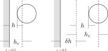
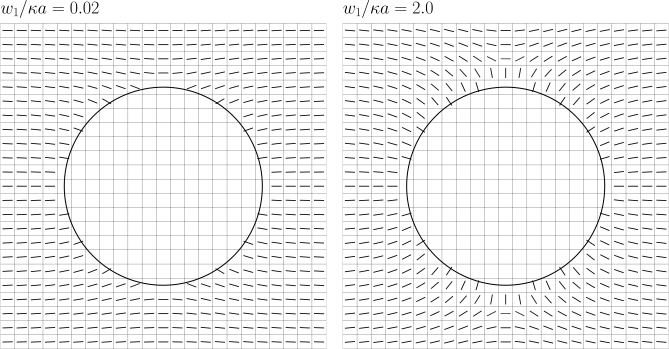

Colloids
--------

.. contents:: In this section
   :depth: 2
   :local:
   :backlinks: none

Introducing colloids
^^^^^^^^^^^^^^^^^^^^

If no relevant key words are present, no colloids will be
expected at run time. The simulation will progress in the
usual fashion with fluid only.

If colloids are required, the ``colloid_init``
key word must be present to allow the code to determine where
colloid information will come from. The options for the
``colloid_init`` key word are summarised below:

.. code-block:: none

  colloid_init             none

  #  none                  no colloids [DEFAULT]
  #  input_one             one colloid from input file
  #  input_two             two colloids from input file
  #  input_three           three colloids from input file
  #  input_random          Small number at random
  #  from_file             Read a separate file (including all restarts)

For idealised simulations which require 1, 2, or 3 colloids, relevant
initial state information
for each particle can be included in the input file. In principle, most
of the colloid state as defined in the colloid
state structure in ``colloid.h`` may be specified. (Some state is
reserved for internal use only and cannot be set from the input file.)
Furthermore, not all the state is relevant in all simulations ---
quantities such as charge and wetting parameters may not be required,
in which case they a simply ignored.

A minimal initialisation is shown in the following example:

.. code-block:: none

  colloid_init              input_one

  colloid_one_a0            1.25
  colloid_one_ah            1.25
  colloid_one_r             12.0_12.0_12.0

This initialises a single colloid with an input radius :math:`a_0=1.25`,
and a hydrodynamic radius :math:`a_h=1.25`; in general both are required,
but they do not have to be equal.
A valid position is required within the extent of the system
:math:`0.5 < x,y,z < L + 0.5` as specified by the ``size`` key word.
State which is not explicitly defined is initialised to zero.

Single colloid initialisation
^^^^^^^^^^^^^^^^^^^^^^^^^^^^^

A full list of colloid state-related key words is as follows. All
the quantities are floating point numbers unless explicitly stated
to be otherwise:

.. code-block:: none

  # colloid_one_nbonds      (integer) number of bonds
  #   colloid_one_bond1     (integer) index of bond partner 1
  #   colloid_one_bond2     (integer) index of bond partner 2
  # colloid_one_isfixedr    colloid has fixed position (integer 0 or 1)
  # colloid_one_isfixedv    colloid has fixed velocity (integer 0 or 1)
  # colloid_one_isfixedw    colloid has fixed angular velocity (0 or 1)
  # colloid_one_isfixeds    colloid has fixed spin (0 or 1)
  # colloid_one_shape       'sphere' [the default] or 'ellipsoid'
  # colloid_one_bc          boundary condition 'bbl' [the default] or 'subgrid'
  # colloid_one_active      active switch [no]
  # colloid_one_magnetic    magnetic switch [no]
  # colloid_one_a0          input radius
  # colloid_one_ah          hydrodynamic radius
  # colloid_one_al          subgrid offset parameter (subgrid only)
  # colloid_one_r           position vector
  # colloid_one_v           velocity (vector)
  # colloid_one_w           angular velocity (vector)
  # colloid_one_s           spin (unit vector)
  # colloid_one_m           direction of motion (unit) vector for swimmers

Note that for magnetic particles, the appropriate initialisation involves
the spin key word ``colloid_one_s`` which relates to the dipole
moment :math:`\mu \mathbf{s}_i`, while ``colloid_one_m`` relates to the
direction of motion vector. Do not confuse the two.
It is possible in principle to have magnetic active particles,
in which case the dipole direction or spin (:math:`\mathbf{s}_i`) and the
direction of swimming motion :math:`\mathbf{m}_i` are allowed to be distinct.

.. code-block:: none

  # colloid_one_b1          Squirmer parameter B_1
  # colloid_one_b2          Squirmer parameter B_2
  # colloid_one_rng         (integer) random number generator state
  # colloid_one_q0          charge (charge species 0)
  # colloid_one_q1          charge (charge species 1)
  # colloid_one_epsilon     Permeativity
  # colloid_one_c           Wetting parameter C
  # colloid_one_h           Wetting parameter H

Example: Single active particle (a squirmer)
""""""""""""""""""""""""""""""""""""""""""""

The following example shows a single active particle with initial
swimming direction along the :math:`x`-axis.

.. code-block:: none

  colloid_init              input_one

  colloid_one_shape         sphere
  colloid_one_active        yes
  colloid_one_a0            7.25
  colloid_one_ah            7.25
  colloid_one_r             32.0_32.0_32.0
  colloid_one_v             0.0_0.0_0.0
  colloid_one_m             1.0_0.0_0.0
  colloid_one_b1            0.05
  colloid_one_b2            0.05

Fixed position or velocity
""""""""""""""""""""""""""

It is possible to fix the position or velocity of a colloid via

.. code-block:: none

  colloid_one_isfixedr       1
  colloid_one_isfixedv       1

It is also possible to do this on a per co-ordinate direction basis
using

.. code-block:: none

  colloid_one_isfixedrxyz    0_0_1
  colloid_one_isfixedvxyz    0_0_1

to, for example, fix the :math:`z`-poisition and velocity components only.

Ellipsoidal particles
^^^^^^^^^^^^^^^^^^^^^

One may select, e.g.,

.. code-block:: none

  colloid_one_shape       ellipsoid

which will allow the use of prolate ellipoids. Additional information
is required to define the semi-major axes, and an initial orientation.
The semi-major axes :math:`a, b, c` are introduced via the key

.. code-block:: none

  colloid_one_elabc       7.5_2.5_2.5    # a, b, c

At the moment that are a number of constraints on this choice. We must have
:math:`a >= b >= c` for an ordinary ellipsoid, with an additional constraint
that :math:`b = c` if the particle is active, or requires surface anchoring
boundary conditions.

It is not possible to use an ellipse in two dimensions.

Initial orientation of ellipsoids
"""""""""""""""""""""""""""""""""
There are two ways available to specify the initial orientation of an ellipsoid
(defined by the lines along the principal axes :math:`a` and :math:`b`).
The first is via a standard :math:`z-x-z` set of Euler angles
(specified in degrees):

.. code-block:: none

  colloid_one_euler    90.0_30.0_0.0     # Euler angles (degrees)

These angles will be used to compute the initial orientation internally.

The second way is to define two vectors which align along the first and
second principle axis (:math:`a` and :math:`b`). This is done via

.. code-block:: none

  colloid_one_elev1    1.0_1.0_1.0        # First vector
  colloid_one_elev2    1.0_0.0_0.0        # Second vector

The vectors do not have to be unit vectors; they do not even have to be
at right angles (the second will be orthogonalised against the first).
However, they must not be parallel (linearly dependent). Again, the
related orientation (including the third axis) will be computed internally.

Initialisation of orientation in colloid state files
""""""""""""""""""""""""""""""""""""""""""""""""""""

The internal representation of current ellipsoid orientation is using a unit
quaternion. This is what appears in the colloid state file used for input
and output. If one wants to generate an appropriate input file, the relevant
unit quaternion must be computed.

Many colloid initialisation at random
^^^^^^^^^^^^^^^^^^^^^^^^^^^^^^^^^^^^^

For suspensions with more than few colloids, but still at
relatively low volume fraction (10--20% by volume), it is
possible to request initialisation at random positions.

The additional key word value pair ``colloid_random_no``
determines the total number of particles to be placed in
the system. To prevent particles being initialised very
close together, which can cause problems in the first few
time steps if strong potential interactions are present,
a grace distance or minimum surface-surface separation
may also be specified (``colloid_random_dh``).

The following example asks for 100 colloids to be initialised
at random positions, with a minimum separation of 0.5 lattice
spacing.

.. code-block:: none

  colloid_init              input_random

  colloid_random_no         100             # Total number of colloids
  colloid_random_dh         0.5             # "Grace" distance

  colloid_random_a0         2.30
  colloid_random_ah         2.40

An input radius and hydrodynamic radius must be provided: these
are the same for all colloids.
If specific initialisations of the colloid state (excepting the
position) other than the radii are wanted, values should be provided
as for the single particle case in the preceding section, but using
``colloid_random_a0`` in place of ``colloid_one_a0`` and so on.

The code will try to initialise the requested number in the current
system size, but only makes a finite number of attempts to place
particles at random with no overlaps. (The initialisation will also
take into account the presence of any solid walls, using the same
grace distance.) If the the number of particles is too large, the
code will halt with a message to that effect.

In general, colloid information for a arbitrary configuration with many
particles should be read from a pre-prepared file. See the section on
File I/O for further information on reading files.

Colloid interactions
^^^^^^^^^^^^^^^^^^^^

Note that two-body pair-potential interactions are defined uniformly for
all colloids in a simulation. The same is true for lubrication corrections.
There are a number of constraints related to the computation of
interactions discussed below.

Boundary-colloid lubrication correction
"""""""""""""""""""""""""""""""""""""""

Lubrication corrections (here the normal force) between a flat wall
are required to prevent overlap between colloid  and the wall.
The cutoff distance is set via the key word value pair

.. code-block:: none

  boundary_lubrication_rcnormal    0.5    # normal cut-off distance
                                          # Note this is 'rcnormal'

It is recommended that this is used in all cases involving walls.
A reasonable value for the cut off is in the range
:math:`0.1 < h_c < 0.5` in lattice
units, and should be calibrated for particle hydrodynamic radius
and fluid viscosity :math:`\eta` if exact results are important.

The form of the lubrication correction for a colloid of hydrodynamic
radius :math:`a_h` and velocity :math:`U_\alpha` is based on the
analytical expression for the lubrication force between a plane wall and
a sphere:

.. math::

   f_\alpha = - 6\pi \eta a_h \left( \frac{1}{h} - \frac{1}{h_c} \right)
                {\hat n}_\beta U_\beta {\hat n}_\alpha \quad\quad (h < h_c)

where :math:`{\hat n}_\alpha` is the unit normal between the wall and the
centre of the colloid. The correction is zero for :math:`h > h_c`.
The surface-surface separation is :math:`h` and
the cut off is :math:`h_c` as illustrated in the following diagram on the
left. In this illustration, the wall position (full line) is at the default
value of :math:`x = 0.5` for the lower end of the system in the
:math:`x`-direction.

In some situations it may be useful to prevent colloids approaching the
wall to within some fixed separation. It is possible to provide a uniform
offset the apparent position of the wall by a fixed amount :math:`\delta h`.
This is illustrated on the right above. The lubrication correction will
then diverge at the new wall position (dotted line). This can be useful
to maintain clear fluid lattice sites between wall and colloid.

The relevant input key is

.. code-block:: none

  boundary_lubrication_dhnormal    0.2    # normal offset distance (+ve)
                                          # [Default: 0]

For both the cut-off, and the offset distance, there is a single input
value which takes effect in all three co-ordinate directions if a wall is
present in the corresponding direction.
In practice, the lubrication correction between wall and colloid should
be very robust.

Boundary-colloid soft sphere potential
""""""""""""""""""""""""""""""""""""""

In some circumstances it may be desirable to use a conservative potential
at a boundary wall in place of the lubrication correction. In this case a
cut-and-shifted soft sphere potential is available. Foe example:

.. code-block:: none

  wall_ss_cut_on       yes                    # Switch
  wall_ss_cut_epsilon  0.001                  # Energy scale
  wall_ss_cut_sigma    0.1                    # Length scale
  wall_ss_cut_nu       2.0                    # Exponent
  wall_ss_cut_hc       0.5                    # wall-surface cut off

Both the exponent and the wall-surface cut off should be positive. The
potential will take effect at boundary walls in all directions.

Colloid-colloid lubrication corrections
"""""""""""""""""""""""""""""""""""""""

The key words to activate the calculation of lubrication corrections
are:

.. code-block:: none

  lubrication_on                   1
  lubrication_normal_cutoff        0.5
  lubrication_tangential_cutoff    0.05

Soft-sphere potential
"""""""""""""""""""""

A cut-and-shifted soft-sphere potential of the form
:math:`v \sim \epsilon (\sigma/r)^\nu` is
available. Some trial-and-error with the parameters may be required in
any given situation to ensure simulation stability in the long run. The
following gives an example of the relevant input key words:

.. code-block:: none

  soft_sphere_on            1                 # integer 0/1 for off/on
  soft_sphere_epsilon       0.0004            # energy units
  soft_sphere_sigma         1.0               # a length
  soft_sphere_nu            1.0               # exponent is positive
  soft_sphere_cutoff        2.25              # a surface-surface separation

Soft-sphere potential (type-specific)
"""""""""""""""""""""""""""""""""""""

This potential is of the same form as the basic cut-and-shifted
soft-sphere potential
described above, but allows different parameters to be specified for
colloids with different *interaction type*. The interaction type is
an integer specified by the appropriate element of the colloid
structure, e.g., via input

.. code-block:: none

  colloid_one_interact_type   0
  ...
  colloid_two_interact_type   1

specifying two different types (0 and 1). The first type must have
index 0. Interactions between different pairs then all have the form
:math:`v_{ij} \sim \epsilon_{ij} (\sigma_{ij}/r)^{\nu_{ij}}`.

The type specific pair interaction is then introduced via

.. code-block:: none

  pair_ss_cut_ij          yes
  pair_ss_cut_ij_ntypes   2

the second key value pair giving the number of types expected. The parameters
then form a symmetric matrix, for which we specific the upper triangle as
a flattened vector. In the case of two types, there are three independent
parameters, e.g.,

.. code-block:: none

  pair_ss_cut_ij_epsilon  0.2_0.1_0.05  # epsilon_00, _01, _11 in order

where we specify :math:`\epsilon_{00}, \epsilon_{01}` and
:math:`\epsilon_{11}`,
being the interaction energies for interactions bewtween pairs of type
(0,0), (0,1), and (1,1) respectively. The value :math:`\epsilon_{10}` is
set to be the same as :math:`\epsilon_{01}` internally.
A full set of key value pairs might be

.. code-block:: none

  pair_ss_cut_ij          yes           # Switch on
  pair_ss_cut_ij_ntypes   2             # Number of types n
  pair_ss_cut_ij_epsilon  0.0_0.1_0.0   # n(n+1)/2 epsilon parameters
  pair_ss_cut_ij_sigma    0.0_2.0_0.0   # n(n+1)/2 sigma parameters
  pair_ss_cut_ij_nu       1.0_1.0_3.0   # n(n+1)/2 nu exponents
  pair_ss_cut_ij_hc       0.1_0.4_0.1   # n(n+1)/2 surface-surface cut offs

The user must ensure all colloids have appropriate interaction types, i.e.,
the interaction type does not exceed 1 in this case.

Lennard-Jones potential
"""""""""""""""""""""""

The Lennard-Jones potential is controlled by the following key words:

.. code-block:: none

  lennard_jones_on          1                 # integer 0/1 off/on
  lj_epsilon                0.1               # energy units
  lj_sigma                  2.6               # potential length scale
  lj_cutoff                 8.0               # a centre-centre separation

Yukawa potential
""""""""""""""""

A cut-and-shifted Yukawa potential of the form
:math:`v \sim \epsilon \exp(-\kappa r)/r` is
available using the following key word value pairs:

.. code-block:: none

  yukawa_on                 1                 # integer 0/1 off/on
  yukawa_epsilon            1.330             # energy units
  yukawa_kappa              0.725             # an inverse length
  yukawa_cutoff             16.0              # a centre-centre cutoff

Dipole-dipole interaction and the Ewald sum
"""""""""""""""""""""""""""""""""""""""""""

The Ewald sum is completely specified in the input file
by the uniform dipole strength $\mu$ and the real-space cut off :math:`r_c`.

.. code-block:: none

  ewald_sum                 1                 # integer 0/1 off/on
  ewald_mu                  0.285             # dipole strength mu
  ewald_rc                  16.0              # real space cut off

If short range interactions are required, particle information is stored
in a cell list, which allows efficient computation of the potentially
:math:`N^2` interactions present. This gives rise to a constraint that the
width of the cells must be large enough that all relevant interactions
are included. This generally means that the cells must be at least
:math:`2a_h + h_c` where :math:`h_c` is the largest relevant cut off
distance.

The requirement for at least two cells per local domain in parallel
means that there is a associated minimum local domain size. This is
computed at run time on the basis of the input. If the local domain
is too small, the code will terminate with an error message. The
local domain size should be increased.

External forces
"""""""""""""""

The following example requests a uniform body force in the negative
:math:`z`-direction on all particles.

.. code-block:: none

  colloid_gravity           0.0_0.0_-0.001    # vector

The counterbalancing body force on the fluid which enforces the
constraint of momentum conservation for the system as a whole is
computed automatically by the code at each time step.

Note: in a real system, a gravitational force on a colloid is
related to buoyancy :math:`F \propto \Delta\rho g`, where the density
difference is that between the colloid and the surrounding fluid,
and :math:`g` is an acceleration.
In a system where there is no density contrast, as we have here
(typically), the "gravity" is the product :math:`\Delta\rho g`. Formally,
this may be viewed as the limit that :math:`\Delta\rho \rightarrow 0`,
combined with the limit :math:`g \rightarrow \infty`, but the limit of
the product is finite.

As a separate alternative, one can specify

.. code-block:: none

  colloid_buoyancy          0.0_0.0_-0.001    # vector

which introduces a force proportional to the volume of each individual
colloid. (The ``colloid_gravity`` option is a constant force, independent
of colloid size.) One cannot
specify both a buoyancy and a gravity force at the same time. The
appropriate counterbalancing force on the fluid is again computed
internally.

One should not specify both a gravitational force (or buoyancy) at the
same time a a body force on the fluid (see below).

Note that if the system has a "bottom", e.g., a plane wall normal to
the direction of the gravitational force, the counterbalancing force
on the fluid is not really required. However, it is always present
in the current implementation irrespective of any walls.

Body force on the fluid when colloids are present
"""""""""""""""""""""""""""""""""""""""""""""""""

It is possible to impose an external body force on the fluid
as described in :ref:`Constant body forces` to provide, effectively,
a pressure gradient.
If colloids are present, a contribution to the force on the colloid
proportional to the colloid's discrete volume is applied. This gives
the same total momumtum input as if the colloid were replaced by fluid.

It is not possible to have both a both an external gravitational force on
the colloid (as via ``colloid_gravity``) and a body force on the fluid at
the same time.

Liquid crystal anchoring at colloid surfaces
^^^^^^^^^^^^^^^^^^^^^^^^^^^^^^^^^^^^^^^^^^^^

The preferred orientation of the liquid crystal director at the surface
of a colloid can be of one of two different types:

.. code-block:: none

   lc_anchoring_coll        normal
   lc_anchoring_coll        planar

For both cases, the chosen condition appliess to all colloids in the
system in the same way.

The liquid crystal anchoring boundary condition is implemented via the
calculation of the tensor order parameter gradients at the surface of
the colloid. We assume there is a surface free energy density (per unit
area)

.. math::

   f_s = f_s(Q_{\alpha\beta}, Q^0_{\alpha\beta})

where :math:`Q_{\alpha\beta}` us the adjacent fluid order parameter, and
:math:`Q^0_{\alpha\beta}` is some preferred otder parameter determined
by the type of anchoring.

The boundary condition is derived from the Euler-Lagrange equation, and
contains gradient terms in the bulk free energy density and the surface
free energy density :math:`f` and :math:`f_s`, along with the outward
unit normal at the surface :math:`\hat{n}_\gamma`:

.. math:

   \hat{n}_\gamma \frac{\partial f}{\partial Q_{\alpha\beta,\gamma}}
   + \frac{\partial f_s}{\partial Q_{\alpha\beta}} = 0

A suitable gradient computation must be selected (see below).

Normal (or homoetropic) anchoring at colloid surfaces
"""""""""""""""""""""""""""""""""""""""""""""""""""""

If the preferred orientation of order at the colloid surface is normal
to the surface (also referred to as homoetropic anchoring), the surface
free energy density per unit area may be written

.. math::

   f_s = {\textstyle\frac{1}{2}} w_1 (Q_{\alpha\beta} - Q^0_{\alpha\beta})^2.

Here, :math:`w_1` is a parameter, and :math:`Q_{\alpha\beta}` is the
local fluid order parameter. The preferred orientation is based on
the outward normal :math:`\hat{n}_\gamma` at the surface
(in the direction from the centre of the colloid to the relevant fluid
site at the surface). The order parameter tensor

.. math::

   Q^0_{\alpha\beta} = {\textstyle\frac{1}{2}}
   A (3\hat{n}_\alpha \hat{n}_\beta - \delta_{\alpha\beta})

The value of :math:`A` corresponds to that which minimises the bulk
free energy (depending on the temperature :math:`\gamma`). The full
boundary condition for the order parameter gradient at the colloid
surface then contains the term

.. math::

   \frac{\partial f_s}{\partial Q_{\alpha\beta}} =
   -w_1 (Q_{\alpha\beta} - Q^0_{\alpha\beta}).

The relevant input key/value pairs for normal colloid anchoring are:

.. code-block:: none

   lc_coll_anchoring      normal     # anchoring type
   lc_coll_anchoring_w1   0.002      # free energy parameter w_1

It is often appropriate to set the value of the surface free energy
parameter in the context of the bulk elastic constant, e.g., by
considering the dimensionless group :math:`w_1/\kappa a`, where
:math:`a` is the radius of the colloid.

As an example, an ordinary nematic is initialised with the
director along the :math:`x`-direction, and a single stationary
sphereical colloid with normal anchoring introduced to the system. The nematic
is allowed to relax with no hydrodynamics. A section of the resulting
director field is shown for a "weak" anchoring case (left), and a
"strong" anchoring case (right). The :math:`x`-direction is in the
horizontal. In the strong anchoring case, it can
be seen that a defect in the orientational order has appeared above
and below the surface of the colloid. In three dimensions, this defect
is present all around the circumference of the colloid and forms a
"Saturn ring".

While the nominal radius of the colloid is indicated by the circle, it
should be remembered that the discrete shape is block-like, as indicated
by the presence of director in individual grid cells.

Planar (or degenerate) anchoring at colloid surfaces
""""""""""""""""""""""""""""""""""""""""""""""""""""
For planar anchoring, the preferred orientation is in the local tangent
plane at the surface: this is a degenerate case as any orientation in
the plane is energetically equivalent. An appropriate boundary
condition is described by Fournier and Galatola [FournierGalatola2005]_,
which we write as

.. math::

   f_s = \textstyle{\frac{1}{2}}
         w_1 (\tilde{Q}_{\alpha\beta} - \tilde{Q}^\perp_{\alpha\beta})^2
       + \textstyle{\frac{1}{2}}
	 w_2 (\tilde{Q}^2 - S_0^2)^2.

To compute this term we take the local fluid order parameter
:math:`Q_{\alpha\beta}`, form the quantity

.. math::

   \tilde{Q} = Q_{\alpha\beta} + \textstyle{\frac{1}{2}} A \delta_{\alpha\beta}

which is then projected onto the tangent plane via
:math:`\tilde{Q}^\perp_{\alpha\beta} = P_{\alpha\gamma} \tilde{Q}_{\gamma\sigma} P_{\sigma\beta}`
with the local surface normal entering through
:math:`P_{\alpha\beta} = \delta_{\alpha\beta} - \hat{n}_\alpha \hat{n}_\beta`.
(Again, the normal at the colloid surface is based on the displacement from
the colloid centre.)
The full boundary condition arising from the surface free energy contains
the terms

.. math::

   \frac{\partial f_s}{\partial Q_{\alpha\beta}} =
   - w_1(\tilde{Q}_{\alpha\beta} - \tilde{Q}^\perp_{\alpha\beta})
   - 2w_2(\tilde{Q}^2_{\alpha\beta} - S_0^2) \tilde{Q}_{\alpha\beta}.

The term :math:`S_0 = 3A/2`, with amplitude :math:`A` as described
above for normal anchoring.

Relevant input parameters are:

.. code-block:: none

  lc_coll_anchoring      planar
  lc_coll_anchoring_w1   0.01        # both w1 and w2 must be present
  lc_coll_anchoring_w2   0.005

Following the example for normal anchoring, the illustration below shows
the result for planar anchoring with :math:`w_1 = w_2` (weak and strong
cases are left and right, respectively). In the strong case one can
identify a pair of point defects at either side of the colloid, usually
referred to as "boojums". Note that the director has actually rotated
into the third dimension at these points and so appears forshortened.

.. figure:: colloid-anchoring-planar.svg
   :alt: Example of planar anchoring at colloid surface (weak and strong)
   :figwidth: 95%
   :align: center

Anchoring when more than one colloid is present
"""""""""""""""""""""""""""""""""""""""""""""""

If more than one colloid is present in the system, then the surface
normal can become poorly defined if adjacent lattice sites are
occupied by different colloids. If such cases the anchoring term
is set to zero in the boundary condition. The advice here is to prevent
close approaches between colloids by means of, e.g., a soft-sphere
potential. This should ensure that fluid sites are always present in
the gap.

Colloid initial conditions from file
^^^^^^^^^^^^^^^^^^^^^^^^^^^^^^^^^^^^

Initial colloid state may be read from an appropriately formatted file
when using the key

.. code-block:: none

  colloid_init             from_file

when the initial time is zero. A restart file will be expected if the
initial time is not zero.

A short utility program ``util/colloid_init.c`` is provided as an example
of how to produce a file in the correct format. The program can be
edited to set up the relevant configuration (e.g., system size, etc)
and recompiled using ``make``.

A number of options for generating random sphere packings are available
depending on the solid volume fraction needed. These random packings are
intended for spheres. Additional steps would be required to generate a
random packing of ellipsoids. Generating such a sphere packing can done
effectively in serial.

The colloid indices specified in this file must be unique, and be
integers in the range 1 to the total number of colloids. Each colloid
should have
at least an index, a position, a shape specificer, and a boundary
condition specifier. All other properties default to zero. See
the Section on :ref:`Colloid Output` for further details on the format
of this file.

The file must have the name ``config.cds.init.001-001`` in the current
working directory at run time.
