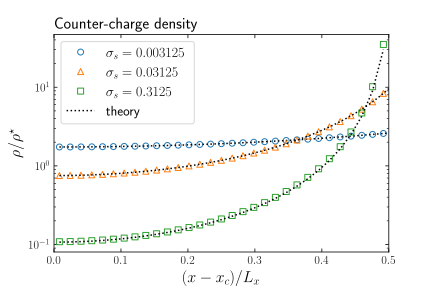
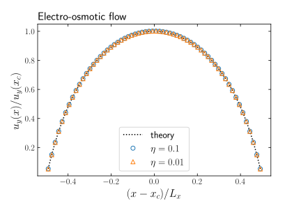
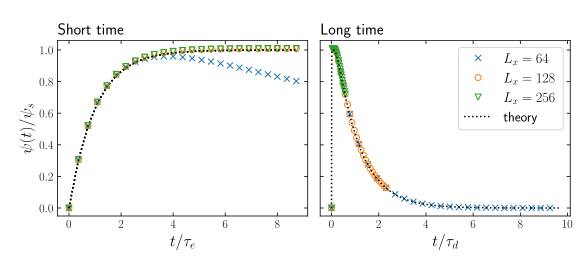

Electrokinetics
---------------

.. contents:: A single fluid with two or more charged species.
   :depth: 2
   :local:
   :backlinks: none

Background: Poisson-Boltzmann approach
^^^^^^^^^^^^^^^^^^^^^^^^^^^^^^^^^^^^^^

A simple electrolyte model consists of :math:`k` charged species,
which are assumed to have the same unit charge :math:`e`, but
with different valencies :math:`Z_k`. There is a charge density
:math:`\rho_k(\mathbf{r};t)` associated with each species. In
the most simple case, we might have just two species with
valencies :math:`+1` and :math:`-1` to represent positive and
negative charge. The charge densities are
always positive.

There is a free energy, the density of which may be written

.. math::

   f(\mathbf{r};t) = \sum_k \rho_k(\mathbf{r};t)
   \big[ k_BT (\ln\rho_k(\mathbf{r};t) - 1)
         + \textstyle\frac{1}{2} Z_k e \psi(\mathbf{r};t) \big]

where :math:`k_BT` is the temperature, and :math:`\psi(\mathbf{r};t)` is
the electric potential. There also may appear in the square brackets a
reference chemical potential, which is here taken to be zero. There is a
chemical potential associated with each species:

.. math::

  \mu_k(\mathbf{r};t) = k_BT \log\rho_k(\mathbf{r};t) + Z_k e \psi(\mathbf{r};t).

The time evolution of the individual charge densities in this model is

.. math::

  \partial_t \rho_k + \partial_\alpha \rho_k u_\alpha =
  \partial_\alpha D_k \big[ \partial_\alpha \rho_k +
                             \beta Z_k e \rho_k \partial_\alpha \psi \big]

where the inverse temperaure :math:`\beta = 1/k_BT` has been introduced.
The update combines the divergence of the advective fluxes, related to
the hydrodynamic velocity field :math:`u_\alpha`, and divergence of
diffusive fluxes related to the gradient of the chemical potential.
Each charged species has a diffusivity :math:`D_k`, which is taken
to be uniform.

The electric potential, and therefore the electric field, is related
to the total charge density :math:`\rho_\mathrm{el}(\mathbf{r};t)
= \sum_k Z_k e \rho_k(\mathbf{r};t)`
via a Poisson equation

.. math::

  \partial_\alpha^2 \psi(\mathbf{r};t) = -4\pi l_B \rho_\mathrm{el}(\mathbf{r};t).

This introduces the Bjerrum length :math:`l_B = e^2 / 4\pi\epsilon k_BT`,
where :math:`\epsilon` is the dielectric permittivity. The Bjerrum
length is a measure of the scale on which the thermal energy and the
electrostatic energy are comparable. It is assumed that the potential
responds instantaneously to changes in the charge density. In cases
where the permittivity is not uniform, it can be useful to write the
Poisson equation as

.. math::

  \partial_\alpha \epsilon(\mathbf{r}) \partial_\alpha \psi(\mathbf{r};t) =
  - e^2 \beta \rho_\mathrm{el}(\mathbf{r};t).

A spatially-varying dielectric constant is required in cases such as a
binary fluid. However, in what follows it is assumed the dielectric is
uniform.

The Nernst Planck equation
""""""""""""""""""""""""""

Diffusive fluxes in the Nernst Plank equation are computed as

.. math::

   -D_k \exp(-\beta \mu_k(r;t))
   \partial_\alpha [\rho_k(r;t) \exp(\beta \mu_k(r;t))].

This ensures that diffusive fluxes vanish in equilibrium in the finite
difference implementation.
Both advective and diffusive fluxes may be computed on the basis of a
7-point, a 19-point or a 27-point stencil. The corresponding stencil is used
in the solution of the Poisson equation in the PETSc implementation.

Units and length scales
"""""""""""""""""""""""

Depending on the exact nature of the problem under consideration, there may
be a number of relevant physical or dimensionless quanitities that need to
be considered. As all quantities in the code are expressed in lattice units,
some care may be required to ensure physical or dimensionless quantities
respect an appropriate hierarchy, even if they cannot all be matched to
realistic experimental values at the same time.

The Bjerrum length :math:`l_B` discussed above, is the smallest relevant
length scale in the problem, and in the examples below, :math:`l_B` is
usually set to something just under one lattice unit :math:`\Delta x`.
The means appropriate choices for the temperature and dielectric
permittivity should be made. We usually chose a temperature to be in the
same range as would be adopted for isothermal fluctuations in the fluid,
but the two temperatures should not be conflated: the temperature in the
context of the electrokinetic free energy is a separate concern. This
sets the choice for the dielectric permittivity.

There is typically a Debye length :math:`l_D` which measures the screening
length associated with the fundamental charge :math:`e`. The Debye length
is related to the Bjerrum length via

.. math::

   l_D = \Big( 4\pi l_B e \sum_k \rho_k Z_k^2 \Big)^{-1/2}

where the :math:`\rho_k` are the local charge densities as discussed
above. We would expect the Debye length to be significant larger than
the Bjerrum length,  while a typically problem will want to resolve
many Debye lengths. This will guide reasonable choices for charge
densities. Some further cases are illustrated in the examples below.

Electrokinetic example problems
^^^^^^^^^^^^^^^^^^^^^^^^^^^^^^^

In the following sections, we consider some simple benchmark examples
which illustrate the use of the electrokinetic model, and how to
control the input and initial conditions.

Most of these problems are quasi-one-dimensional:

Gouy-Chapman problem: counter-ions only
"""""""""""""""""""""""""""""""""""""""

As a first example, we consider the classical problem of the diffusive
double layer set up near a wall which carries a surface charge
:math:`\sigma_s`.

A sample input file ``tests/regression/d3q19-short/serial-elec-gc1.inp``
is available for this problem.

The geometry will be discussed below. First, we set the following
values to provide two charged species.
(At the moment, the code always expects exactly two charged species
in the input.)

.. code-block:: none

  electrokinetics_eunit    1.0       # The unit charge "e"
  electrokinetics_z0        +1       # Valency first species
  electrokinetics_z1        -1       # Valency second species
  electrokinetics_epsilon  3.3e3     # Dielectric permittivity

  temperature              3.3333e-5 # temperature k_BT

Taken together, these set the Bjerrum length :math:`l_B \simeq 0.72` in
lattice units. We must provide a diffusivity for each species,
which we set to be:

.. code-block:: none

  electrokinetics_d0            0.01 # diffusivity species k = 0
  electrokinetics_d1            0.01 # diffusivity species k = 1

Note that the input adopts the C-like convention that the first
species is :math:`k= 0` and the second species is :math:`k=1`
for the labels.

We wish to have a one-dimensional problem with a wall. As we are
obliged to have a finite system size, it is convenient to set a
wall at each end of the system. This is performed with the special
initialisation:

.. code-block:: none

  electrokinetics_init          gouy_chapman   # initialisation key

This sets up two solid walls, one at each each end of the system
in the :math:`x`-direction, each occupying one lattice site (at
:math:`x=1` and at :math:`x = L_x`). The fluid length of the system
is then :math:`L_x - 2`. We have two other input keys to provide
the initial charge density information:

.. code-block:: none

  electrokinetics_init_rho_el   0.0            # fluid charge density
  electrokinetics_init_sigma    0.003125       # surface charge

A surface positive charge (an area density) of :math:`\sigma_s = 0.003125`
is specified, and this is applied at each wall giving a total positive
charge of :math:`2\sigma_s`. The surface charge, by virtue of occupying
a solid site, is immobile. The initial fluid charge densities are
specified to be zero.

However, we *must* ensure that the system is, overall, electroneutral.
For the ``gouy_chapman`` initialisation, the code automatically ensures
this by setting a uniform fluid counter-charge density
(here the negative charge) to be :math:`\rho(x;t=0) = 2\sigma_s / (L_x - 2)`.

For this problem there is an analytical solution available
for the equilibrium charge density
(e.g., [Israelachvili2011]_, Chapter 14).
This writes the counter charge density as

.. math::

   \rho(x) = \rho_0 \sec^2(Kx)

where the centreline charge density
:math:`\rho_0 = \rho(x=x_c) = K^2/2\pi Z^2 l_B`. In general, :math:`K`
is the solution of the transcendental equation

.. math::

   K \tan(KL_x/2) = -2\pi Z (\sigma_s/e) l_B.

This allows us to determine :math:`K` from :math:`\sigma_s` and :math:`L_x`
and hence the counter-charge density profile. The following Figure shows
the fluid counter-charge density
(normalised by :math:`\rho^\star = \sigma_s/L_x`)
for (right-hand) half system length for three different values of
the surface charge.
The theoretical result is also show in each case as the dotted line.

.. [Israelachvili2011] J.N. Israelachvili *Intermolecular and surface forces*
		       Academic Press (2011).

Electro-osmotic flow
""""""""""""""""""""

A similar problem can be used to test the influence of an external
electric field, and hence the coupling between the electrostatic
components and the flow. The configuration
is the same as that discussed above with counter-charge only in the
fluid contained by walls at each end with a fixed surface charge. A uniform
electric field :math:`(0, E_y, 0)` is applied to the system, driving a
flow parallel to the walls.

The steady state velocity field of the fluid may be derived from the
force balance between the gradient of the stresses and the electrostatic
force. This gives rise to an expression:

.. math::

   u_y(x) = \frac{eE_y \rho_0}{\eta K}
            \ln\Bigg(\frac{\cos(Kx)}{\cos(K L_x/2)}\Bigg)

where :math:`K` and :math:`\rho_0` are computed from the transcendental
equation as described above, and :math:`\eta` is the fluid viscosity.

A sample input file for this problem is provided at:
``tests/regression/d3q19-short/serial-elec-eo1.inp``

The electric field is introduced via

.. code-block:: none

  electric_e0                   0.0_0.001_0.0  # External field

The Figure below shows the steady state velocity :math:`u_y(x)` resulting
from simulations with two viscosities :math:`\eta = 0.1`
and :math:`\eta = 0.01` subjected to dimensionless field
:math:`eE_y L_x /k_BT = 1860`. The surface charge is :math:`\sigma_s = 0.03125`.
The case with higher viscosity is run for 100,000 steps, and the case
with lower viscosity is run for 300,000 steps to reach an approximately
steady state. The results are shown normalised by the theoretical centre-line
speed.

Time-dependence: A liquid junction
""""""""""""""""""""""""""""""""""

A further problem which examines time-dependence is that of a liquid junction.
This is again a quasi-one-dimensional problem where the system is
uniform in the :math:`y`-direction  and :math:`z`-direction.
An example input file may be found at
``tests/regression/d3q19-short/serial-elec-lj1.inp``.

For this problem, a step in the charge densities is introduced at time
:math:`t = 0`
at the mid-point of the system. This is arraged by the special initialistion

.. code-block:: none

    electrokinetics_init          liquid_junction     # use liquid junction
    electrokinetics_init_rho_el   0.01                # rho0
    electrokinetics_init_delta_el 0.0002              # delta rho0

We have two charged species with valancies :math:`\pm 1`, which
we will refer to as :math:`\rho_+` and :math:`\rho_{-}`, indicating
the relevant charges. Both charged species are
initialised to :math:`\rho_0 + {\scriptstyle\frac{1}{2}}\delta\rho_0`
in the left half of the system, and to
:math:`\rho_0 - {\scriptstyle\frac{1}{2}}\delta\rho_0`
in the right half of the system. (This ensures overall charge
neutrality). The step is therefore of size :math:`\delta\rho_0`
in each species.

Another key characteristic of the problem is that the two species
have different difffusivities:

.. code-block:: none

    electrokinetics_d0            0.0105
    electrokinetics_d1            0.0095

Again, we will refer to the two diffusivities as :math:`D_+` and
:math:`D_{-}` in what follows.

A theoretical description of this problem has been provided by, e.g.,
Mafe *et al.* [MafeManzanaresPellicer1988]_ . This describes the
separation process which occurs when
the initial step is allowed to evolve. Charges from the region of
higher concentration diffuse into the other half of the system with
lower concentration. Owing to the difference in diffusivity,
the two species migrate at different rates leaving parts of the system
with net charge. This leads to a build-up of a potential difference which
balances the diffusisive flux.

This initial "electric relaxation" occurs on a time scale :math:`\tau_e`,
characterised as a short time scale, with

.. math::

   \tau_e = \frac{\epsilon}{\beta e^2 (D_+ + D_-)\rho_0}.

In this short-time regime the potential difference as a function of time
may be written

.. math::

   \psi(t) \approx \psi_s (1 - e^{-t / \tau_e})

where the saturation potential at times :math:`t >> \tau_e` is

.. math::

   \psi_s = \frac{(D_+ - D_{-})}{\beta e (D_+ + D_{-})}
            \frac{\delta\rho_0}{\rho_0}.

After the initial electric relaxation, the potential difference decreases
slowly again as the charge concentrations become homogeneous throughout
the system. This long-time, or diffusive time scale is characterised by

.. math::

   \tau_d = \frac{L_x^2}{2\pi^2 (D_+ + D_{-})}.

A full solution in the long-time limit is provided by Mafe *et al.*, which
is appropriate in certain conditions. We must have a Debye length
:math:`l_D` which is short
conpared with the system length :math:`L_x`, and the diffusivisties should
be close together in the sense that :math:`(D_+ - D_{-})/(D_+ + D_{-})` is
small compared with unity.
This long-time solution combines the short-time approximation with an
additional term related to the diffusion time:

.. math::

    \psi(t) = \psi_s (1 - e^{-t/\tau_e})
             \Bigg\{ \frac{4}{\pi} \sum_{m=1}^{N} \frac{\sin^3 m\pi/2}{m}
	        \exp(-m^2 t /\tau_d) \Bigg\}.

While a complete discussion of this solution omitted here, it is enough
to note that the upper limit on the number of significant terms in the
sum is estimated by Mafe *et al.* to be :math:`N = L_x/\pi l_D`. This
estimate allows a computation of the theoretical result.

To test the numerical values obtained for the liquid junction problem,
three different cases are considered which differ only in the system
length, and therefore the diffusive time scale :math:`\tau_d`. The
system lengths used are :math:`L_x =` 64, 128 and 256. Two
runs are made in each case: one to examine the short-time regime, and
one to look at the long-time regime.
The maximum and minimum of the potential reported in the standard
output are used to evalaute the potential difference as a function
of time. The resulting potential difference is normalised by the
saturation potential given above. For the short time regime, times
are normalised by the "electric" time scale :math:`\tau_e` (the
same in all cases); for the long time regime, times are normalised
by the diffusive time scale :math:`\tau_d`.

Note:

1. For the shortest system size :math:`L_x =` 64, the electric and
   diffusive time scales are not well separated, and the potential
   barely reaches the saturation value before the long-time
   decay sets in.
2. For the long time regime, a fixed number of time steps has been
   used to allow the curves to be distinguished more clearly. The
   collapse of the data to the theoretical value is sound in all
   cases throughout the range (data not shown).

.. [MafeManzanaresPellicer1988] S. Mafe, J.A. Manzanares, and J. Pellicer,
   The charge separation process in non-homogeneous electrolyte solutions,
   *J. Electroanal. Chem.* **241** 57-77 (1988).

General options
^^^^^^^^^^^^^^^

Poisson solver
""""""""""""""

The Poisson equation for the electric potential is solved numerically
by either an in-build successive over-relaxation (SOR) approach, or
using a Krylov method via PETSc. (PETSc must have been included at the
compilation stage for the latter option.)

The type of solver used, and some associated parameters can be
controlled at run time via the following parameters.

.. code-block:: none

    electrokinetics_solver_type    sor       # or "petsc" if available
    electrokinetics_solver_reltol  1.0e-15   # Relative tolerance [1.0e-08]
    electrokinteics_solver_abstol  1.0e-50   # Absolute tolerance [1.0e-15]

The tolerance specifies the size of the residual (based on the
:math:`L_2` norm) at which the iterative solver is deemed to have
converged.

Finite difference stencil
"""""""""""""""""""""""""

The finite difference stencil used in the electrokinetic sector is
controlled at run time by

.. code-block:: none

    electrokinetics_solver_stencil   7     # 7 point stencil [the default]

It is customary to match the stencil with the lattice Boltzmann model
currently in use, although this need not be the case. The weights in
the finite difference stencil are
matched to the standard weights in the lattice Boltzmann basis.
Options for 7-point, 19-point or 27-point stencils exist.

Input and output
""""""""""""""""

File output for electrokinetic properties is via the usual mechanism.
One file is produced to hold the potential (a single scalar value per
lattice site), and one file to hold the charge densities (usually two
per lattice site). An example of output might be:

.. code-block:: none

    -rw-r--r--  1 kevin  staff  49152 Apr 10 16:42 psi-000005000.001-001
    -rw-------  1 kevin  staff    718 Apr 10 16:42 psi-metadata.001-001
    -rw-r--r--  1 kevin  staff  96256 Apr 10 16:42 qsi-000005000.001-001
    -rw-------  1 kevin  staff    718 Apr 10 16:42 qsi-metadata.001-001

The ``psi`` files are the potential, and the ``qsi`` files are the charge
densities. Data files for time step 5000 are shown above. Output is
controlled in the input file via key value pair of the form.

.. code-block:: none

    psi_io_mode                     mpiio    # Manadatory
    psi_io_format                   ascii    # "ascii" or "binary" ["binary"]
    psi_io_report                   no       # Report on output    ["no"]

Both the metadata files associated with the with the electrokinetic
quantities should contain an additional entry in JSON format of the
form:

.. code-block:: none

           "electrokinetics":      {
                "Number of species":    2,
                "Unit charge":  1,
                "Boltzmann factor":     30000,
                "First permittivity":   3300,
                "Second permittivity":  3300,
                "Valencies":    [1, -1],
                "Diffusivities":        [0.01, 0.01],
                "External field":       [0, 0.001, 0],
                "Solver options":       {
                        "Solver type":  "sor",
                        "Maximum iterations":   10000,
                        "Level of verbosity":   0,
                        "Frequency of output":  1000,
                        "Stencil points":       7,
                        "Relative tolerance":   1e-08,
                        "Absolute tolerance":   1e-15
                }

This may be useful for post-processing purposes. See the section on
:ref:`Fluid Output` for further comments on output data formats for
fluid quantities.
