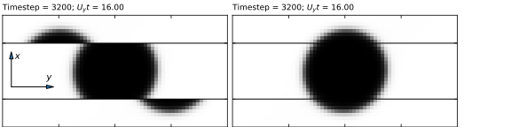

Lees Edwards BCs
----------------

.. contents:: This section contains some details on using Lees Edwards
	      boundary conditions.
   :depth: 2
   :local:
   :backlinks: none

Background: Sheared molecular dynamics
^^^^^^^^^^^^^^^^^^^^^^^^^^^^^^^^^^^^^^

Lees and Edwards [LeesEdwards1972]_ introduced the idea of sliding periodic
boundary conditions in the context of molcular dynamics as a mechanism to
impart shear. The algorithm has a number of advantages over other methods:
it allows, in principle, high shear rates and it does not introduce any
solid boundary which would disrupt the linear shear regime with boundary
effects.

The computational picture is illustrated schematically below. A central
computational system :math:`CS` (shaded) is surrounded by periodic, or
cyclic, images :math:`CS'` (copies of which extend infinitely in all
directions; only the immediate neighbours of :math:`CS` are shown).
One imagines that the first row of images above the central system
slide at a velocity :math:`+U_y` relatative to :math:`CS`, a second
row above would slide at a velocity :math:`+2U_y` relative to :math:`CS`,
and so on. Likewise, successive rows below
slide at :math:`-U_y,-2U_y` and so on relative to the central system.

.. figure:: le-schematic-md.svg
   :alt: Schematic illustration of a shearing periodic system
   :figwidth: 80%
   :align: center

We assume that at time :math:`t = 0` the system is aligned in the standard
periodic configuration where there is no relative displacement of the rows.
In general, a particle leaving the top of the computational system
:math:`CS` with coordinate :math:`y` would enter the adjacent image
at a corresponding position :math:`y' = y - U_yt`. The corresponding
coordinate in the true computational system is then :math:`y'' = y - 2U_yt`.
Displaced positions :math:`y + U_y t` may always be reduced by modulo
:math:`L_y` to return the relevant particle coordinate to the true
computational system.

The :math:`y`-component of the velocity of a particle leaving the top of
the central system is transformed via :math:`v_y' = v_y - U_y`.
The corresponding component of velocity of a particle at the
lower boundary of the true system would be :math:`v_y''  = v_y - 2U_y`.

For a particle leaving the bottom of the central system the
sign of :math:`U_y` in the corresponding transformations is reversed.

Background: Shear for lattice Boltzmann
^^^^^^^^^^^^^^^^^^^^^^^^^^^^^^^^^^^^^^^

Wagner and Pagonabarraga [WagnerPagonabarraga2002]_ were the first to
introduce the idea of Lees Edwards sliding periodic boundaries in the
lattice Boltzmann picture. The idea here is slightly different to the
case of molecular dynamics. We consider a single computational system
which is sub-divided into one or more blocks by the introduction of
internal Lees Edwards boundaries. (The boundaries we often refer to
as Lees Edwards "planes".) In the the illustration below there are
four boundaries, or planes, with positions :math:`x_1, \ldots, x_4`.

	 Paganobarraga
   :figwidth: 80%
   :align: center

At each boundary, a notional particle crossing in the positive
:math:`x`-direction undergoes the Galilean transformation
:math:`v_y' = v_y + U_y`, with corresponding transformation
:math:`v_y = v_y' - U_y` if travelling in the negative
:math:`x`-direction. There is an analogous position
transformation as a function of time of :math:`y' = y  \pm U_yt`.
So the picture is one in which we have
discrete blocks which are - conceptually - in relative motion, with
the central block considered a rest frame.

The net result is a single system in which we can impose an overall
shear rate :math:`\dot{\gamma} = NU_y/L_x`, where :math:`N` is the
number of planes. This allows a larger shear rate than would be
possible with a single set of sliding periodic boundaries (as in
the molecular dynamics case) as the largest speed relative to
the lattice in any block is restricted to :math:`v_y \sim U_y`.
This respects the low Mach number constraint of lattice Boltzmann.

There are a number of points to note:

1. We retain the picture in which :math:`x` is the velocity gradient,
   or shear, direction, and :math:`y` is the flow direction. While not
   shown in the illustrations, the :math:`z`-direction is the
   voriticity direction. As there are no additional special considerations
   for the vorticity direction, it is easiest to use two-dimensional
   examples.
2. There is a "standard" periodic boundary in the :math:`x`-direction,
   and in the other two dimensions.

The picture for an odd number of planes is slightly different, and is
not discussed here; we recommend sticking to an even number of planes.
(There is no particular reason to use an odd number of planes, and it
is easier to arrange the relevant spacing and parallel decomposition
with an even number.)

Practicalities: generating and analysing results
^^^^^^^^^^^^^^^^^^^^^^^^^^^^^^^^^^^^^^^^^^^^^^^^

The input for the example discussed below is found in the repository
in the ``docs/tutorial/lees-edwards`` in the `repository
<https://github.com/ludwig-cf/ludwig/tree/develop/docs/tutorial/lees-edwards>`_
along with some sample output. The code has been compiled with ``-D_D2Q9_``.

See also the :doc:`/inputs/lespc` page for details of input key value
pairs for Lees Edwards boundaries.

Raw results
"""""""""""

The  picture above is one of a single system with a number of blocks
sliding relative to one another in the flow direction. In practical
implementation, of course, data do not move in memory, which is
fixed. We can see this if we examine the raw output, where we expect
to see a "displaced" picture as a function of :math:`U_y t`.

For the purposes of illustration we consider the simple example
of a binary droplet in two dimensions. The droplet is initialised in
the centre of a system with two Lees Edwards planes having
:math:`U_y = 0.005` (the shear rate :math:`\dot{\gamma} = 2U_y/L_x`).
We show below the unprocessed output for times
:math:`t = 0`, and :math:`t = 3200`, the latter corresponding to
:math:`U_yt = 16.0`. We've adopted the same coordinate orientation as
in the schematics above.

.. figure:: le-droplet-raw.svg
   :alt: Unprocessed results from a simulation with two planes
   :figwidth: 100%
   :align: center

It can be seen that the planes (two horizontal lines) separarate
different blocks in the computational system. At first sight, the
displacement of the structure may not be what is expected; one must
remember that, conceptually, the whole of the upper block is
translating to the right, and the whole of the lower block to
the left.

If the displacement were a whole number of system lengths :math:`L_y`,
the picture would actually be the correct one.
However, to be useful in the general case, we need to adjust the raw
output to allow for the relevant block displacements. This process
is referred to as "unrolling", and can be performed using a utility
provided.

"Unrolling" the output
""""""""""""""""""""""

Information about the system in the meta data file includes the details
of the Lees Edwards planes. For the binary droplet case, we would
look for ``phi-metadata.001-001`` which is produced automatically at run
time. In out illustrative case, we should see the JSON section:

.. code-block:: none

  "lees_edwards": {
          "Number of planes":     2,
          "Shear type":   "STEADY",
          "Reference time":       0,
          "Plane speed":  0.005
  }

This, along with the time step (which is encoded in individual file
names) allows the appropriate displacement :math:`U_y t` to be made
by the extraction utility.

To perform the unrolling for the raw output ``phi-000003200.001-001`` one
would run, e.g.,

.. code-block:: none

  $ ./extract phi-000003200.001-001
  ...
  Writing result to phi-000003200
  Completed processing for phi-000003200.001-001

The utility will identify this file as the scalar order parameter field
for composition from the ``phi-`` stub, and look for the corresponding
metadata file ``phi-metadata.001-001``. Files for different time steps
(also identified from the file name) share the same metadata file.
The unrolled file will be in the same format as the original, and can
the viewed in the same way.

There are a number of points to note about this process:

1. If :math:`U_y t` is not an integer (the general case) data are
   interpolated using cubic interpolation to bring values back to
   the lattice points.
2. The unrolled data should be used for analysis only; the original
   raw data is always used for restart purposes.

The velocity field in the presence of planes
""""""""""""""""""""""""""""""""""""""""""""

A similar discussion is relevant for the velocity field, with the
additional consideration that the component of the velocity in
the flow direction must be corrected for the relative motion of
the blocks. This correction is made automatically by the extraction
utility if it detects that the input is the velocity field.

.. code-block:: none

  $ ./extract vel-0000032000.001-001
  ...
  Data is velocity field
  Writing result to vel-000003200
  Complete processing for vel-000003200.001-001

To illustrate, we plot a single profile of the fluid velocity component
:math:`u_y(x,L_y)` using the same binary droplet example, but use a
position :math:`y = L_y` away from the droplet. This is shown below
for both (left) the uncorrected values and (right) the corrected
values. The uncorrected values are the components relative to the
lattice, whereas the corrected values are the view from the central
rest frame.

.. figure:: le-droplet-flow.svg
   :alt: Flow at the lattice level and corrected for two Lees Edwards
	 boundaries.
   :figwidth: 100%
   :align: center

In a fully-developed flow in a simple fluid, this would be a linear
shear profile.

Choice of rest frame
""""""""""""""""""""

In the example above, the data are unrolled with respect to the central
block. This gives rise to a picture in which the viewer sees the flow
moving to the right in the upper half of the system, and to the left in
the lower half of the system.

The choice of the rest frame is actually arbitrary. One could chose a
different block in the computational system to be the rest frame,
e.g., the bottommost block at :math:`x = 0`. This gives rise to a
picture in with the viewer sees the flow stationary at the bottom
and moving with :math:`u_y \simeq NU_y` at the top. Experience
suggests this can be slightly "unsettling" for the viewer. We therefore
always use the central block as the rest frame.

.. [LeesEdwards1972] A.W. Lees and S.F. Edwards,
		     The computer study of transport processes under extreme
		     conditions,
		     *J. Phys. C: Solid State Phys.,* **5** 1921-1929 (1972).

.. [WagnerPagonabarraga2002] A.J. Wagner and I. Pagaonabarra
			     Lees-Edwards boundary conditions for lattice
			     Boltzmann,
			     *J. Stat. Phys.,* **107** 521-537 (2002).
