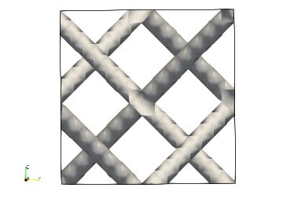

Liquid Crystal Output
---------------------

.. contents:: Some examples in processing and visualising liquid crystal
	      order parameters
   :depth: 2
   :local:
   :backlinks: none

Liquid crystal order parameters
^^^^^^^^^^^^^^^^^^^^^^^^^^^^^^^

The dynamics of the liquid crystal problem are based on the symmetric,
traceless, tensor order parameter :math:`Q_{\alpha\beta}(\mathbf{r};t)`.
The model carries five independent components of this tensor in
three dimensions, which are always stored to file as
:math:`Q_{xx}, Q_{xy}, Q_{xz}, Q_{yy}` and :math:`Q_{yz}`
(five scalar entities).

For the purposes of analysis and visualisation, it is actually
preferable to consider a different set of quantities which are: the
(scalar) order parameter, the director, and the (scalar) bi-axial order
parameter. Specifically, the scalar order parameter is the largest
eigenvalue of Q, the director is the associated eigenvector, while
the bi-axial order parameter is related to the two largest eigenvalues.
Physically, the scalar order parameter is expected to vanish at
disclinations, and the director is the orientation of the rod-like
molecules (a directionless vector); the bi-axial order parameter
reflects the degree to which the order is 'plate-like' as against
'rod-like'.

These latter quantities may be generated by diagonalising the tensor
:math:`Q_{\alpha\beta}(\mathbf{r};t)` at each position and time step.
For any given problem, it may be relevant to look at one or more of
these quantities.

Examples: processing LC output
^^^^^^^^^^^^^^^^^^^^^^^^^^^^^^

We assume a computation has produced a binary file ``q-000010000.001-001``
for some appropriate input configuration, along with the associated
meta data file. Computing and storing the
diagonalised quantities currently involves running the post-processing
utility ``util/extract``. Some example are given below.

VTK output for the director
~~~~~~~~~~~~~~~~~~~~~~~~~~~

From the command line, run

.. code-block:: none

   $ ./extract -k -d q-000010000.001-001
   ...
   Writing computed director with vtk: lcd-000010000.vtk
   Complete processing for q-000010000.001-001

The output here is a single file prefixed ``lcd``
with the director field as a vector.

VTK output for the scalar order parameter
~~~~~~~~~~~~~~~~~~~~~~~~~~~~~~~~~~~~~~~~~

For the scalar order parameter, use the ``-s`` option:

.. code-block:: none

   $ ./extract -k -s q-000010000.001-001
   ...
   Writing computed scalar order with vtk: lcs-000010000.vtk
   Complete processing for q-000010000.001-001

The output is a VTK file prefixed ``lcs`` with the scalar order parameter.

VTK output for the bi-axial order parameter
~~~~~~~~~~~~~~~~~~~~~~~~~~~~~~~~~~~~~~~~~~~

If required, use the ``-x`` option:

.. code-block:: none

   $ ./extract -k -x q-000010000.001-001
   ...
   Writing computed biaxial order with vtk: lcb-00000000.vtk
   Complete processing for q-000000000.001-001

This prodcues a file with the ``lcb`` prefix, which is the scalar
bi-axial order parameter.

It is possible to combine the ``-s``, ``-d`` and ``-x`` options to
get more than one output at one time, if required. These VTK files
may be visualised in the usual way.

Raw output for all quantities
~~~~~~~~~~~~~~~~~~~~~~~~~~~~~

The following command can be used:

.. code-block:: none

   $ ./extract -a q-000010000.001-001
   ...
   Writing computed scalar q etc: q-000000000
   Complete processing for q-000000000.001-001

This generates a single ASCII file with five columns. The order
is :math:`s, d_x, d_y, d_z, b` with :math:`s` the scalar order
parameter and :math:`b` the bi-axial order parameter; the
director is :math:`(d_x,d_y,d_z)`. Note there
is no file extension. Use the ``-b`` option instead if raw
binary format output is wanted; the results are in the same
order.

Example: visualising the scalar order parameter
^^^^^^^^^^^^^^^^^^^^^^^^^^^^^^^^^^^^^^^^^^^^^^^

Copy the example input ``docs/tutorial/liquid-crystal`` to an appropriate
location and run the run. The input specifies a relatively small system
with free energy parameters which are appropriate for blue phase one (with
a cubic symmetry). The run is a short one to allow the initial conditions
to relax, and we expect to be able to visualise the disclination lines in
the final structure.

Run the input through the code, e.g.,

.. code-block:: none

   $ export OMP_NUM_THREADS=4
   $ mpirun -np 1 ./Ludwig.exe blue-phase-visual.inp

This should take around minute (the exact choice of parallel options
is not important). A single unprocessed order paarameter file
``q-000010000.001-001`` should be produced. Run the ``extract``
program to obtain the scalar order parameter:

.. code-block:: none

   $ ./extract -k -s q-000010000.001-001

The resulting VTK file can be read into, for example, Paraview in the
usual way. Apply a ``Contour`` filter to the data. It should be seen
that the scalar order parameter varies between about 0.06 and 0.37.
In order to obtain a coherent picture of the disclination structure
a value of around 0.22 may be required for the isosurface value.
In theory, the scalar order should vanish at the disclinations, but
in the discrete model, this is not the case.

An example of the output is given below with a single isosurface
contour value of 0.22. It can be seen that the disclinations are
resolved at the level of around 2-3 lattice sites (the system size is
16 cubed.). A two-dimensional camera view has been
selected to more closely reflect the cubic symmetry.

If the contour value selected is too low, the picture will ultimately
become fragmented and the isosurface discontinuous.

The director field
~~~~~~~~~~~~~~~~~~

To view the director field in Paraview, proceed as for a vector field
and apply a ``Glyph`` filter, but select ``Line`` instead of
``Arrow`` from the ``Glyph Type`` menu in the ``Glyph``
properties section. Some adjustment of the scale factor may
also be required to obtain a reasonable picture.
