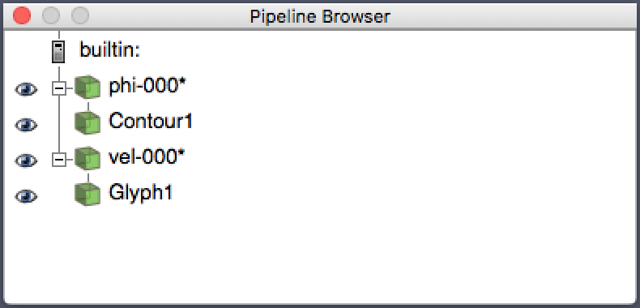

Spinodal Decomposition
----------------------

.. contents:: An example of spinodal decomposition in a binary
	      fluid and how to process and visualise the results
   :depth: 2
   :local:
   :backlinks: none

Spinodal decomposition in a binary fluid
^^^^^^^^^^^^^^^^^^^^^^^^^^^^^^^^^^^^^^^^

It is assumed that the code has been compiled in the parallel version
for ``-D_D3Q19_``.

1. Copy the input file from ``docs/tutorial/test2/input`` to your current
   working directory. The input sets up a small three-dimensional
   system and uses the symmetric free energy. The initial composition
   is set to ``spinodal`` which introduces a small-amplitude noise in
   the otherwise uniform initial field to initiate spinodal decomposition.

2. Run the code (we assume in the current working directory) using, e.g.,

   .. code-block:: none

     $ mpirun -np 4 ./Luwdig.exe

3. Statistics are reported at every 500 time steps, and output files are
   produced at 1000 step intervals for 10,000 steps. The compositional
   (scalar) order parameter appears in files ``phi-``. At the end of
   execution there should be 10 time steps worth of data. Velocity and
   density files are also produced.

4. As requested in the input, the format for these files is binary. In
   general, this is a more efficient format (than ASCII) in terms of
   both file size, and time taken to read and write the files. The
   metadata data files are always ASCII and can still be viewed as
   normal.

Manipulating the output files
^^^^^^^^^^^^^^^^^^^^^^^^^^^^^

While it is possible to view the binary (raw) data without further
processing, in some cases it may be necessary to process the raw
output data to get a meaningful picture. This is done with the
``extract`` utility, which is found in the ``util`` directory.

1. For this example, we process the data to produce VTK format files
   which can then be read into, for example, Paraview. [Paraview]_

2. To process a single data file, the extract utility is run with
   the data file as the sole (positional) argument and the ``-k``
   option:

   .. code-block:: none

     $ ./extract -k phi-000010000.001-001
     ...
     Writing result to phi-000010000.vtk
     Complete processing for phi-000010000.001-001

   The ``-k`` is an instruction to re-write the data in VTK format. This
   is an ASCII file whoich can be inspected.
   As reported, the resultant file has extension ``.vtk`` to replace
   ``.001-001``. [vtkOptions]_

3. To process a series of files, it can be convenient to use the loop
   feature of the shell, e.g.,

   .. code-block:: none

     $ for f in phi-000*.001-001; do ./extract -k ${f}; done

   (Be careful not to include ``phi-metadata.001-001`` in the glob by
   mistake.)
   Repeat the process for the velocity field files ``vel-000*.001.001``.

Using Paraview
^^^^^^^^^^^^^^

VTK format files may be conveniently read into Paraview.

1. From the GUI, clip the open file icon (or ``File->Open`` from the
   pull-down menu)
   and select a individual file, or group of files from the file dialogue.

2. Click on the group of files in the pipeline browser to select, and apply
   a contour filter by selecting ``Filters->Common->Contour`` from the
   pull-down menu or by clicking on the contour icon in the toolbar

.. figure:: contour.png
   :alt: The contour icon in the paraview toolbar is highlighted
   :figwidth: 80%
   :align: center

3. Apply the contour with contour value 0.0. You should see a rendering of
   the :math:`\phi = 0` contour which represents the interface between the
   two components (usually with :math:`\phi^\star = \pm 1`).

4. Load the corresponding velocity field files. Clip on the group of
   velocity files in the pipeline browser, and apply a glyph filter
   from the ``Filters->Common->Glyph`` pull down or using th icon in
   the toobar

.. figure:: glyph.png
   :alt: The glyph icon in the paraview toolbar is highlighted
   :figwidth: 80%
   :align: center

5. In the glyph properties click ``Apply``, and then in the ``Coloring``
   section set the solid color menu to ``velocity_field`` to give a
   velocity magnitude colour scale.

6. One can step thorough the different time steps using the current
   time controls in the topmost toolbar

Many other manipulations are possible in paraview. However, these basic
operations are enough to provide a simple picture.

The final picture
~~~~~~~~~~~~~~~~~

.. figure:: snapshot.png
   :alt: An example paraview snapshot of the interface and velocity field
   :figwidth: 90%
   :align: center

Note we have also reversed the default background and foreground colours
in the abiove image.

The final pipeline
~~~~~~~~~~~~~~~~~~

The final pipeline in the pipeline browser should look like:

|

.. [Paraview] Publicly available for download from https://www.paraview.org/.

.. [vtkOptions] Option ``-k`` produces VTK output in "structured point" format;
		there is also a ``-l`` option which produces VTK
		"rectilinear grid" format.
