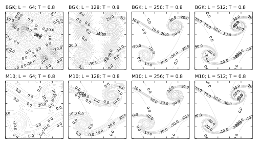

Fluid initial conditions
------------------------

.. contents:: This section describes the initialisation of quantities
              including
   :depth: 1
   :local:
   :backlinks: none

Density
^^^^^^^

The initial fluid density is always uniform and the value can be
controlled via:

.. code-block:: none

  rho0   1.0     # default value 1.0

Some care may be required if values other than unity are used;
some features in the code may not correctly account for general
values.

Velocity field
^^^^^^^^^^^^^^

The default initialisation for the velocity field is uniformly at
rest. If a specific initialisation :math:`u_\alpha (\mathbf{r}; t = 0)`
is required, then in all cases the initial
lattice Boltzmann distributions are taken to be the equilibrium
values

.. math::

  f_i^{\mathrm{eq}} (\mathbf{r}; t = 0)
  = \rho w_i \bigg( 1 + \frac{ u_\alpha c_{i\alpha}}{c_s^2}
                          + \frac{u_\alpha u_\beta (c_{i\alpha}c_{i\beta}
                          - c_s^2 \delta_{\alpha\beta})}{2c_s^4}  \bigg)

where :math:`w_i` and :math:`c_{i\alpha}` are the relevant weights and
discrete velocities for the model in use. The density :math:`\rho` can
be controlled as discussed above.

Uniform
~~~~~~~

A uniform, non-zero, velocity field in three dimensions can be initialised via

.. code-block:: none

  distribution_initialisation  3d_uniform_u
  distribution_uniform_u       0.002_0.003_0.004

For two dimensions, set the :math:`z`-component to zero.

Two-dimensional double shear layer
~~~~~~~~~~~~~~~~~~~~~~~~~~~~~~~~~~

A standard test problem described by Brown and Minion [BrownMinion1995]_
initialises
a velocity field in a system which is the unit square (length :math:`L`) as

.. math::

  \begin{eqnarray}
    u_x & = & \bigg \lbrace {u_0 \tanh \kappa (y-1/4) \text{ for } y \leq 0.5
                     \atop    u_0 \tanh \kappa (3/4-y) \text{ for } y > 0.5} \\
    u_y & = & u_0 \delta \sin 2\pi (x + 1/4)
  \end{eqnarray}

where :math:`u_0` sets the velocity scale,
:math:`\kappa` is an inverse length scale related to the
shear layer, and :math:`\delta` is a dimensionless perturbation parameter.

In a two-dimensional system the following input key value pairs may
be used

.. code-block:: none

  distribution_initialisation   2d_kelvin_helmholtz
  2d_kelvin_helmholtz_u0        0.01                 # Scale speed
  2d_kelvin_helmholtz_delta     0.05                 # Perturbation
  2d_kelvin_helmholtz_kappa     100.0                # inverse width

Example: matching units
"""""""""""""""""""""""

If we wish to run a problem similar to that described as a thin shear
layer by Brown and Minion (:math:`\kappa = 100`) and examine the
results as a function of resolution, we need to work out the relevant
lattice Boltzmann inputs (in lattice units) by matching some appropriate
dimensionless groups.

Brown and Minion have a fixed system size :math:`L = 1` and increase
the resolution by decreasing the grid spacing.
Larger values of the grid spacing give a relative poor
resolution of the shear layer.
A shear layer width in reduced units would be :math:`1/L\kappa`,
and we can specify a reduced time :math:`T_0 = \Delta x / u_0 \delta`.

In the lattice Botlzmann, we keep the resolution :math:`\Delta x`
fixed and increase the system size to :math:`L = N`, the number
of grid points. To respect the Mach number constraint, we can set,
e.g, :math:`u_0 = 0.01`. To find the lattice Boltzmann viscosity,
we can then match a Reynolds number in each case. Brown and Minion
have, e.g., :math:`Re = u_0 \delta L / \nu = 500` for
:math:`u_0 \delta = 0.05`
and a kinematic viscosity :math:`\nu = 1/10,000`. The lattice
dynamic vicosity would then be :math:`\eta` (with :math:`\rho = 1`)
and should then
match :math:`Re = \rho u_0 \delta N / \eta`.

It is convenient to retain the same units for :math:`\kappa` in the
input and convert internally. Finally, the number of lattice Boltzmann
time steps is fixed to match the time T = 0.8 via the reduced time
:math:`T/T_0`.

An example input file with actual values can be found in

.. code:: none

  ./tests/regression/d2q9/serial-2kh-bm1.inp

A series of representative results are shown below for a number
of different resolutions (64, 128, 256, 512 from left to right)
and for two different relaxation time schemes.

Broadly, the M10 scheme is more dissipative, which helps avoid the development
of noise in the more poorly resolved cases. In the limit of high resolution
the results are verysimilar. For a more recent discussion of this problem in
the context of lattice Boltzmann relaxation see
e.g., Dellar [Dellar2014]_ and references therein.

.. [BrownMinion1995] D.L. Brown and M.L. Minion, Performance of under-resolved
                     two-dimensional incompressible flow simulations,
                     *J. Computat. Phys.*, **122** 165-183 (1995).
.. [Dellar2014] P.J. Dellar, Lattice Boltzmann algorithms without cubic
                     defects in Galilean invariance on standard lattices,
                     *J. Computat. Phys.* **259** 270-283 (2014).
