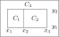
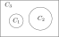
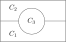
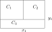

Three-phase model
-----------------

.. contents:: This section describes some available initial coniditions for
              for the three-phase model of [Semprebon2016]_
   :depth: 2
   :local:
   :backlinks: none

This implementation assumes the density :math:`\rho` is unity and two scalar
order parameters (:math:`\phi` and :math:`\psi`) define the composition.
The three phases are defined by concentrations
:math:`C_1 = (\rho + \phi - \psi)/2`,
:math:`C_2 = (\rho - \phi - \psi)/2` and :math:`C_3 = \psi` so that we
have:

===== ============ ============ ============ =========== ===========  ===========
Phase :math:`\rho` :math:`\phi` :math:`\psi` :math:`C_1` :math:`C_2`  :math:`C_3`
===== ============ ============ ============ =========== ===========  ===========
One      1           1              0            1        0            0
Two      1          -1              0            0        1            0
Three    1           0              1            0        0            1
===== ============ ============ ============ =========== ===========  ===========

.. [Semprebon2016] C. Semprebon, T. Krueger, and H. Kusumaatmaja, Ternary free-energy
                   lattice Boltzmann model with tunable surface tensions and
                   contact angles, *Phys. Rev. E*, **93** 033305 (2016).

Two dimensions
^^^^^^^^^^^^^^

Note that there is currently no default initialisation of the ternary
composition.

Double emulsion (in blocks)
~~~~~~~~~~~~~~~~~~~~~~~~~~~

.. code-block:: none

  ternary_initialisation       2d_double_emulsion   # Initialisation
  2d_double_emulsion_xf1       0.2                  # Optional: fraction x1
  2d_double_emulsion_xf2       0.5                  # Optional: fraction x2
  2d_double_emulsion_xf3       0.8                  # Optional: fraction x3
  2d_double_emulsion_yf1       0.3                  # Optional: fraction y1
  2d_double_emulsion_yf2       0.7                  # Optional: fraction y2

This initialises two central blocks of composition :math:`C_1` and :math:`C_2`
surrounded by :math:`C_3`. The positions of the 'cuts' are controlled by five
optional parameters, which are fractions of the system length in the relevant
dimension; the default values are shown above.

It is expected that the :math:`z`-dimension will have extent :math:`L_z = 1`,
but it is not enforced; the initialisation will be uniform in :math:`z`.

Double droplet
~~~~~~~~~~~~~~

.. code-block:: none

  ternary_initialisation       2d_double_drop      # Initialisation
  ternary_2d_drop1_radius      2.0                 # radius for C_1 drop
  ternary_2d_drop1_centre      2.0_1.5             # centre for C_1 drop
  ternary_2d_drop2_radius      2.5                 # radius for C_2 drop
  ternary_2d_drop2_centre      4.0_2.0             # centre for C_2 drop

This is a variation of the above using instead of rectangular blocks,
circular droplets. All the parameters specifying the position and the
radii of the two drops must be specified and are in absolute lattice
units.

Drop 1 has composition :math:`C_1` and drop 2 has composition :math:`C_2`,
while the background is :math:`C_3`. If the drops overlap, composition
:math:`C_2` will be favoured.

It is expected that :math:`L_z = 1`, although not enforced. If :math:`L_z > 1`,
cylinders will result.

Lens in two dimensions
~~~~~~~~~~~~~~~~~~~~~~

.. code-block:: none

  ternary_initialisation     2d_lens                #
  ternary_2d_lens_centre     16.0_16.0              # Required: centre (x0, y0)
  ternary_2d_lens_radius     4.0                    # Required: radius

This initialises a circular droplet of phase :math:`C_3` with its centre at the
specified position (absolute coordinates) and with given radius. The horizontal
interface between :math:`C_1` and :math:`C_2`
is always at :math:`L_y/2`. Such an initial condition, upon relaxation, should
give rise to a lens shape depending on the equilibrium contact angles selected.

Again, it is expected that the :math:`z`-dimension will have extent
:math:`L_z = 1`,
but it is not enforced; the initialisation will be uniform in :math:`z`.

T-shape in two dimensions
~~~~~~~~~~~~~~~~~~~~~~~~~

.. code-block:: none

  ternary_initialisation   2d_tee                  # initialisation
  ternary_2d_tee_xf1       0.50                    # optional: fraction of L_x
  ternary_2d_tee yf1       0.33                    # optional: fraction of L_y

Three rectangular blocks are initialised with sharp interfaces forming
an inverted 'T'-shape. The default positions of the interfaces are
shown above, with the optional parameters specifying the fractional
position of the vertical and horizontal interfaces.
The default parameters give roughly equal areas of the three components
in a square system with disposition as shown in the diagram.

This initialisation can be useful in, for example, assessing the wetting
angles formed at solid boundaries at each side of the box.

Three dimensions
^^^^^^^^^^^^^^^^

Details on three-dimensional configurations are pending.

Three-phase configuration from file
^^^^^^^^^^^^^^^^^^^^^^^^^^^^^^^^^^^

.. code-block:: none

  ternary_initialisation      from_file        # Request from single file
  ternary_file_stub           ternary.init     # This is the default

Arbitrary composition fields may be supplied from file of appropriate
format. This file must contain exactly two scalar fields :math:`\phi`
and :math:`\psi` (:math:`\rho` does not appear and is dealt with
via the lattice Boltzmann distributions).

The file stub name can be set with the key ``ternary_file_stub``. Other
I/O parameters are currently dealt with via keys prefixed ``phi_``.
See sections on I/O for details.
