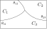

Plane walls
-----------

.. contents:: This section contains some details of plane walls, which
              differ from general porous media in that they support
              presence of colloids.
   :depth: 2
   :local:
   :backlinks: none

Plane boundary walls
^^^^^^^^^^^^^^^^^^^^

As a convenience, it is possible to specifiy that sets of plane walls
are present in the system in one or more co-ordinate directions. For
example, a set of walls in the :math:`y-z` plane are placed at each end
of the system in positions
:math:`x = 0.5\Delta x` and :math:`x = L + 0.5\Delta x` if the input
file contains

.. code-block:: none

  boundary_walls       1_0_0
  periodicity          0_1_1

The extent of the system :math:`L_x` is then just the number of points in
the x-direction as specfied by key ``size``. By default, walls have
no-slip boundary conditions implemented via bounce-back on links.

It is usual, although not strictly necessary, to declare that the relevent
direction is not periodic (as in the example above). It should not make
any difference to the result of the computation.

Walls may be specifed in two dimensions to form a rectangular
"duct", or in all three dimensions to form an enclosed box.
For example:

.. code-block:: none

  boundary_walls       1_1_0     # open in z-direction
  boundary_walls       1_1_1     # enclosed box

Moving wall
"""""""""""

If one set of walls (only) is present, is possible to specify
a boundary speed (in the positive :math:`x`-direction) which will impart
momemtum to the fluid. Use, e.g.,

.. code-block:: none

  boundary_walls          1_0_0
  boundary_speed_bottom  -0.001
  boundary_speed_top     +0.001

will set the corresponsing speed of the wall :math:`u_x` at the lower
at upper ends of the system, 
respectively. Note that these speeds should be selected with reference
to the Mach number constraint :math:`u < c_s`. Momentum transfer here
is again implemented via a no-slip condition via bounce-back on links.

Note the wall speed has only one non-zero component :math:`u_x`, which
should be tangential to the place of the wall (i.e., moving walls
should be in either `y` or `'z` dimensions).

Slip and no-slip
""""""""""""""""

It is possible to specify a linear combination of slip and no-slip
conditions on a per-wall basis. The fraction of slip is specified.
E.g.,

.. code-block :: none

  boundary_walls                    0_0_1
  boundary_walls_slip_active        yes
  boundary_walls_slip_fraction_bot  0.0_0.0_0.0
  boundary_walls_slip_fraction_top  0.0_0.0_1.0

gives a no-slip condition at the lower wall and a free-slip condition
at the top wall (walls in the :math:`x-y` plane). Values of the slip
:math:`s` must satisfy :math:`0 \leq s \leq 1` for all six faces. 
If slip is active, no moving walls can be used.

Colloids and plane walls
""""""""""""""""""""""""

Systems with colloids and walls can be accommodated. To prevent colloids
impinging on the plane walls, a lubrication correction can be added by
setting

.. code-block:: none

  boundary_lubrication_rcnormal   0.25

For surface-surface separations below this cut-off value specified in
lattice units, a normal lubrication correction based on the analytical
expression for the lubrication force between a sphere (of the appropriate
hydrodynamic radius) and a plane wall is added to the force on
the colloid.

Wetting at plane boundary walls
^^^^^^^^^^^^^^^^^^^^^^^^^^^^^^^

Wetting for the symmetric free energy
"""""""""""""""""""""""""""""""""""""

The presence of a surface free energy area density term

.. math::

  f_s = {\scriptsize\frac{1}{2}} C \phi_s^2 + H \phi_s

where :math:`C` and :math:`H` are uniform constants is available. This may
be set is one of two ways. One may either set, explicitly, the value of
one or both :math:`C` and :math:`H`, along with the other free energy
parameters:

.. code-block:: none

  symmetric_a        -0.00625     # A < 0
  symmetric_b         0.00625     # B > 0
  symmetric_kappa     0.004       # kappa > 0
  symmetric_c         0.0         # Default value zero
  symmetric_h         0.002       # Default value zero

Consider the case :math:`C=0`. If :math:`h = H\sqrt{1/\kappa B}`
then the wetting angle will, in theory,
satisfy

.. math::

  \cos\theta = {\scriptsize\frac{1}{2}} \Big[-(1-h)^{3/2} + (1+h)^{3/2}\Big].

The value of :math:`h` must be such that
:math:`|h| < (2\sqrt{3} - 3)^{1/2} \approx 0.68` to
obtain a real wetting angle. From the free energy it can be seen that
positive :math:`H` will favour negative :math:`\phi` at the solid surface,
and vice-versa. In terms of angle, positive :math:`H` gives rise to
:math:`0 \leq \theta \leq 90`; negative :math:`H` gives rise to
:math:`90 \leq \theta \leq 180` (all degrees). Larger :math:`|h|`
will give rise to a situation where one phase or other completely wets
the surface.

Alternatively, on can set a desired wetting
angle, which will cause the relevant value of :math:`H` to be determined
internally (again, :math:`C=0`). E.g.,

.. code-block:: none

  symmetric_theta    45.0         # Angle in degrees.

The sign of :math:`H` will be set to reflect the sign of :math:`\cos\theta`.

If non-uniform values of :math:`C` and :math:`H` are required, a porous
media file must be prepared.

The wetting is implemented [Desplat2001]_
by adjusting the gradient computation near the surface. This means

.. code-block:: none

  fd_gradient_calculation 3d_27pt_solid

is required. 

.. [Desplat2001] J.-C. Desplat, I. Pagonabarraga, and P. Bladon,
                 A parallel lattice Boltzmann code for complex fluids,
                 *Comput. Phys. Comm.* **134** 273-290 (2001).

Wetting for the ternary free energy
"""""""""""""""""""""""""""""""""""

For the three phase fluid free energy, specify the interfacial width and
interfacial tension parameters in the usual way:

.. code-block:: none

  ternary_alpha         1.0
  ternary_kappa1        0.01
  ternary_kappa2        0.02
  ternary_kappa3        0.05
  ternary_h1           -0.001
  ternary_h2           +0.002

We allow the specification of two independent uniform surface wetting
parameters :math:`h_1` and :math:`h_2` with the third being determined
by the constraint

.. math::

  \frac{h_1}{\kappa_1} + \frac{h_2}{\kappa_2} + \frac{h_3}{\kappa_3} = 0.

There are then three contact angles :math:`\theta_{12}`, :math:`\theta_{23}`
and :math:`\theta_{31}`. These are illustrated in the diagram on the right
whre the rectangular box represents a solid surround.

The contact angles depend on the interfacial and surface tensions as,
following the notation of Semprebon 2016:

.. math::

  \cos\theta_{ij} =
  \frac{(\alpha\kappa_i + 4h_i)^{3/2} - (\alpha\kappa_i - 4h_i)^{3/2}}
       {2(\kappa_i + \kappa_j)(\alpha \kappa_i)^{1/2}}
  -
  \frac{(\alpha\kappa_j + 4h_j)^{3/2} - (\alpha\kappa_j - 4h_j)^{3/2}}
       {2(\kappa_i + \kappa_j)(\alpha \kappa_j)^{1/2}}.

The gradient computation must be one of

.. code-block:: none

  fd_gradient_calculation     2d_ternary_solid
  fd_gradient_calculation     3d_ternary_solid

for the three phase model with wetting in either two dimensions
or three dimensions, as required.
