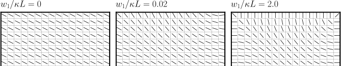
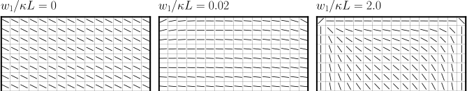

Plane walls
-----------

.. contents:: This section contains some details of plane walls, which
              differ from general porous media in that they support
              presence of colloids.
   :depth: 2
   :local:
   :backlinks: none

Plane boundary walls
^^^^^^^^^^^^^^^^^^^^

As a convenience, it is possible to specifiy that sets of plane walls
are present in the system in one or more co-ordinate directions. For
example, a set of walls in the :math:`y-z` plane are placed at each end
of the system in positions
:math:`x = 0.5\Delta x` and :math:`x = L + 0.5\Delta x` if the input
file contains

.. code-block:: none

  boundary_walls       1_0_0
  periodicity          0_1_1

The extent of the system :math:`L_x` is then just the number of points in
the x-direction as specfied by key ``size``. By default, walls have
no-slip boundary conditions implemented via bounce-back on links.

It is usual, although not strictly necessary, to declare that the relevent
direction is not periodic (as in the example above). It should not make
any difference to the result of the computation.

Walls may be specifed in two dimensions to form a rectangular
"duct", or in all three dimensions to form an enclosed box.
For example:

.. code-block:: none

  boundary_walls       1_1_0     # open in z-direction
  boundary_walls       1_1_1     # enclosed box

Moving wall
"""""""""""

If one set of walls (only) is present, is possible to specify
a boundary speed (in the positive :math:`x`-direction) which will impart
momemtum to the fluid. Use, e.g.,

.. code-block:: none

  boundary_walls          1_0_0
  boundary_speed_bottom  -0.001
  boundary_speed_top     +0.001

will set the corresponsing speed of the wall :math:`u_x` at the lower
at upper ends of the system, 
respectively. Note that these speeds should be selected with reference
to the Mach number constraint :math:`u < c_s`. Momentum transfer here
is again implemented via a no-slip condition via bounce-back on links.

Note the wall speed has only one non-zero component :math:`u_x`, which
should be tangential to the place of the wall (i.e., moving walls
should be in either `y` or `'z` dimensions).

Slip and no-slip
""""""""""""""""

It is possible to specify a linear combination of slip and no-slip
conditions on a per-wall basis. The fraction of slip is specified.
E.g.,

.. code-block :: none

  boundary_walls                    0_0_1
  boundary_walls_slip_active        yes
  boundary_walls_slip_fraction_bot  0.0_0.0_0.0
  boundary_walls_slip_fraction_top  0.0_0.0_1.0

gives a no-slip condition at the lower wall and a free-slip condition
at the top wall (walls in the :math:`x-y` plane). Values of the slip
:math:`s` must satisfy :math:`0 \leq s \leq 1` for all six faces. 
If slip is active, no moving walls can be used.

Colloids and plane walls
""""""""""""""""""""""""

Systems with colloids and walls can be accommodated. To prevent colloids
impinging on the plane walls, a lubrication correction can be added by
setting

.. code-block:: none

  boundary_lubrication_rcnormal   0.25

For surface-surface separations below this cut-off value specified in
lattice units, a normal lubrication correction based on the analytical
expression for the lubrication force between a sphere (of the appropriate
hydrodynamic radius) and a plane wall is added to the force on
the colloid.

Wetting at plane boundary walls
^^^^^^^^^^^^^^^^^^^^^^^^^^^^^^^

Wetting for the symmetric free energy
"""""""""""""""""""""""""""""""""""""

The presence of a surface free energy area density term

.. math::

  f_s = {\scriptsize\frac{1}{2}} C \phi_s^2 + H \phi_s

where :math:`C` and :math:`H` are uniform constants is available. This may
be set is one of two ways. One may either set, explicitly, the value of
one or both :math:`C` and :math:`H`, along with the other free energy
parameters:

.. code-block:: none

  symmetric_a        -0.00625     # A < 0
  symmetric_b         0.00625     # B > 0
  symmetric_kappa     0.004       # kappa > 0
  symmetric_c         0.0         # Default value zero
  symmetric_h         0.002       # Default value zero

Consider the case :math:`C=0`. If :math:`h = H\sqrt{1/\kappa B}`
then the wetting angle will, in theory,
satisfy

.. math::

  \cos\theta = {\scriptsize\frac{1}{2}} \Big[-(1-h)^{3/2} + (1+h)^{3/2}\Big].

The value of :math:`h` must be such that
:math:`|h| < (2\sqrt{3} - 3)^{1/2} \approx 0.68` to
obtain a real wetting angle. From the free energy it can be seen that
positive :math:`H` will favour negative :math:`\phi` at the solid surface,
and vice-versa. In terms of angle, positive :math:`H` gives rise to
:math:`0 \leq \theta \leq 90`; negative :math:`H` gives rise to
:math:`90 \leq \theta \leq 180` (all degrees). Larger :math:`|h|`
will give rise to a situation where one phase or other completely wets
the surface.

Alternatively, on can set a desired wetting
angle, which will cause the relevant value of :math:`H` to be determined
internally (again, :math:`C=0`). E.g.,

.. code-block:: none

  symmetric_theta    45.0         # Angle in degrees.

The sign of :math:`H` will be set to reflect the sign of :math:`\cos\theta`.

If non-uniform values of :math:`C` and :math:`H` are required, a porous
media file must be prepared.

The wetting is implemented [Desplat2001]_
by adjusting the gradient computation near the surface. This means

.. code-block:: none

  fd_gradient_calculation 3d_27pt_solid

is required. 

.. [Desplat2001] J.-C. Desplat, I. Pagonabarraga, and P. Bladon,
                 A parallel lattice Boltzmann code for complex fluids,
                 *Comput. Phys. Comm.* **134** 273-290 (2001).

Wetting for the ternary free energy
"""""""""""""""""""""""""""""""""""

For the three phase fluid free energy, specify the interfacial width and
interfacial tension parameters in the usual way:

.. code-block:: none

  ternary_alpha         1.0
  ternary_kappa1        0.01
  ternary_kappa2        0.02
  ternary_kappa3        0.05
  ternary_h1           -0.001
  ternary_h2           +0.002

We allow the specification of two independent uniform surface wetting
parameters :math:`h_1` and :math:`h_2` with the third being determined
by the constraint

.. math::

  \frac{h_1}{\kappa_1} + \frac{h_2}{\kappa_2} + \frac{h_3}{\kappa_3} = 0.

.. figure:: walls_wet_ternary.svg
   :alt: Ternary surface wetting contact angles
   :figwidth: 30%
   :align: right

There are then three contact angles :math:`\theta_{12}`, :math:`\theta_{23}`
and :math:`\theta_{31}`. These are illustrated in the diagram on the right
whre the rectangular box represents a solid surround.

The contact angles depend on the interfacial and surface tensions as,
following the notation of Semprebon 2016:

.. math::

  \cos\theta_{ij} =
  \frac{(\alpha\kappa_i + 4h_i)^{3/2} - (\alpha\kappa_i - 4h_i)^{3/2}}
       {2(\kappa_i + \kappa_j)(\alpha \kappa_i)^{1/2}}
  -
  \frac{(\alpha\kappa_j + 4h_j)^{3/2} - (\alpha\kappa_j - 4h_j)^{3/2}}
       {2(\kappa_i + \kappa_j)(\alpha \kappa_j)^{1/2}}.

The gradient computation must be one of

.. code-block:: none

  fd_gradient_calculation     2d_ternary_solid
  fd_gradient_calculation     3d_ternary_solid

for the three phase model with wetting in either two dimensions
or three dimensions, as required.

Anchoring for liquid crystals at plane walls
^^^^^^^^^^^^^^^^^^^^^^^^^^^^^^^^^^^^^^^^^^^^

The preferred orientation of the liquid crystal director at a solid
surface is usually referred to as the surface anchoring.
For liquid crystal order there are three possiblities for anchoring
conditions at a plane wall:

.. code-block:: none

  lc_anchoring_wall           fixed
  lc_anchoring_wall           planar
  lc_anchoring_wall           normal

For all cases, the conidition applies at all sides of the system. It is
not possible to have different coniditions at different walls at the
moment.

The liquid crystal anchoring boundary condition is implemented via the
calculation of the order parameter gradients near the walls. We assume
there is a surface free energy (density per unit area)

.. math::

   f_s = f_s(Q_{\alpha\beta}, Q^0_{\alpha\beta})

where :math:`Q_{\alpha\beta}` is adjacent fluid order parameter, and
:math:`Q^0_{\alpha\beta}` is some preferred order parameter at the
surface determined by the type of anchoring.

The boundary condition is derived from the Euler-Lagrange equation,
and contains the gradient terms in the bulk free energy density and
the surface free energy :math:`f` and
:math:`f_s`, along with the unit outward normal at the surface
:math:`\hat{n}_\gamma`:

.. math::

   \hat{n}_\gamma \frac{\partial f}{\partial Q_{\alpha\beta,\gamma}}
   + \frac{\partial f_s}{\partial Q_{\alpha\beta}} = 0.

A suitable gradient computation must be selected (see below).

Only the values above are valid (normal, planar, or fixed); any other value
will generate a run time error. We consider the three cases in turn.

Normal or homoetropic anchoring at walls
""""""""""""""""""""""""""""""""""""""""

The preferred direction of the surface order here is, as the name suggests,
normal to the surface. We can write the surface free energy density (per
unit area):

.. math::

   f_s = \textstyle{\frac{1}{2}} w_1 (Q_{\alpha\beta} - Q^0_{\alpha\beta})^2

where :math:`w_1` is a constant, and :math:`Q_{\alpha\beta}` is the local
fluid order parameter. The preferred orientation is based on the
unit outward normal at the relevant wall :math:`\hat{n}_\gamma`, and is
computed via the uniaxial approximation

.. math::

   Q^0_{\alpha\beta} = \textstyle{\frac{1}{2}}
                       A(3\hat{n}_\alpha \hat{n}_\beta - \delta_{\alpha\beta}).

The value of :math:`A` is dependent on the bulk free energy constant
:math:`\gamma` and is fixed by
assuming :math:`Q^0_{\alpha\beta}` minimes the bulk free energy.
Note that the preferred outward normal where two or three walls meet
at an edge or at a corner, is :math:`45^\circ` outward (see example
below).
The full boundary condition for the order parameter gradient at the solid
fluid boundary then contains the term

.. math::

   \frac{\partial f_s}{\partial Q_{\alpha\beta}} =
   -w_1 (Q_{\alpha\beta} - Q^0_{\alpha\beta}).

The relevant input key/value pairs are:

.. code-block:: none

  lc_wall_anchoring      normal      # anchoring
  lc_wall_anchoring_w1   0.01        # free energy parameter

It can be appropriate to set the value of the free energy parameter
in the context of the bulk fluid elastic constant, e.g., by considering
the dimensionless group :math:`w_1 / \kappa L`, where :math:`L` is an
apprpropriate length scale for the problem. An example is shown in
the following illustration.

 
The above results represent a two-dimensional nemetic in
a square system of size :math:`L^2` surrounded by plane walls
(only the top half of
the system is shown). An initial random nematic director
configuration is allowed to relax with no hydrodynamics, and the
resulting patterns are observed for the three different normal
anchoring strengths shown. Note that the preferred angle in the
corners is :math:`45^\circ` outwards.

	   
Planar (or degenerate) anchoring at walls
"""""""""""""""""""""""""""""""""""""""""

For planar anchoring, the preferred orientation is in the local tangent
plane at the surface: this is a degenerate case as any orientation in
the plane is energetically equivalent. An appropriate boundary
condition is described by Fournier and Galatola [FournierGalatola2005]_,
which we write as

.. math::

   f_s = \textstyle{\frac{1}{2}}
         w_1 (\tilde{Q}_{\alpha\beta} - \tilde{Q}^\perp_{\alpha\beta})^2
       + \textstyle{\frac{1}{2}}
	 w_2 (\tilde{Q}^2 - S_0^2)^2.

To compute this term we take the local fluid order parameter
:math:`Q_{\alpha\beta}`, form the quantity

.. math::

   \tilde{Q} = Q_{\alpha\beta} + \textstyle{\frac{1}{2}} A \delta_{\alpha\beta}

which is then projected onto the tangent plane via
:math:`\tilde{Q}^\perp_{\alpha\beta} = P_{\alpha\gamma} \tilde{Q}_{\gamma\sigma} P_{\sigma\beta}`
with the local surface normal entering through
:math:`P_{\alpha\beta} = \delta_{\alpha\beta} - \hat{n}_\alpha \hat{n}_\beta`.
The full boundary condition arising from the surface free energy contains
the terms

.. math::

   \frac{\partial f_s}{\partial Q_{\alpha\beta}} =
   - w_1(\tilde{Q}_{\alpha\beta} - \tilde{Q}^\perp_{\alpha\beta})
   - 2w_2(\tilde{Q}^2_{\alpha\beta} - S_0^2) \tilde{Q}_{\alpha\beta}.

The term :math:`S_0 = 3A/2`, with amplitude :math:`A` as described
above for normal anchoring.

Relevant input parameters are:

.. code-block:: none

  lc_wall_anchoring      planar
  lc_wall_anchoring_w1   0.01        # both w1 and w2 must be present
  lc_wall_anchoring_w2   0.005

For the same two-dimensional nematic example discussed for normal
anchoring above, initialised with the same random configuration,
the corresponding results for planar anchoring are:

All simulations used :math:`w_1 = w_2` (although experience suggests the
value of :math:`w_2` does not have a strong influence on the result).
Note again that the preferred angle at the corners is at :math:`45^\circ`
(visible in the strong anchoring case on the right).

.. [FournierGalatola2005] J.-B. Fournier and P. Galatola, Modeling planar
			  degenerate wetting and anchoring in nematic
			  liquid crystals,
			  *Europhys. Lett.* **72** 403-409 (2005).

Fixed anchoring direction at walls
""""""""""""""""""""""""""""""""""

Relevant input parameters are:

.. code-block:: none

  lc_anchoring_wall           fixed         # anchoring
  lc_anchoring_wall_w1        0.01          # free energy parameter
  lc_wall_fixed_orientation   1.0_0.0_0.0   # the vector \hat{n}

This choice sets a uniform preferred director :math:`\hat{n}_\alpha`
which gives rise to a preferred order parameter at the fluid next to the
wall of :math:`Q^0_{\alpha\beta}` based on the uniaxial approximation.
The treatment then follows that of normal anchoring as described above.

If the vector supplied in the input is not a unit vector, it will be
adjusted to make it so at run time.

The example again uses the same random initial nemetic configuration in
two dimensions, and the fixed anchoring orientation is along the
:math:`x`-direction (the horizontal here). In this case there is no
distinction between
the "weak" and "strong" cases, as the orientation can be accommodated
everywhere for a nematic.

.. figure:: wall-anchor-fixed.svg
   :alt: Example fixed anchoring for a two-dimensional nematic 
   :figwidth: 100%
   :align: center

Gradient computation for anchoring at walls
"""""""""""""""""""""""""""""""""""""""""""

For the gradient computation it is recommended to use

.. code-block:: none

   fd_gradient_calculation      s7_anchoring

This uses a 7-point stencil in three dimensions to compute the gradient
terms, and can be used for any combination of place walls and colloids.

Note that the alternative anchoring gradient computation

., code-block:: none

   fd_gradient_calculation      3d_7pt_solid

should not be used if walls meeting at edges or corners are required
(as in the above examples). For single plane walls they are the same.
