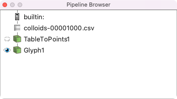

Colloid Postprocessing
----------------------

.. contents:: Some details of how to visualise colloid data
   :depth: 2
   :local:
   :backlinks: none

Colloid output formats
^^^^^^^^^^^^^^^^^^^^^^

Colloid output can be either in ASCII or raw binary format. A simple
example can be found at ``docs/tutorial/colloid-test1``. Copy the
input file to a suitable location and run the code:

.. code-block:: none

   $ ./Ludwig.exe input
   ...

A single colloid configuration in ASCII format should be generated at
the end of this short run of 1000 time steps with name
``config.cds00001000.001-001``. The file can be inspected
with a suitable utility.

These files are used for the purposes of restarting the computation,
but are not particularly convenient for visualisation. An extra
post-processing step is typically required.

Visualising colloid positions
^^^^^^^^^^^^^^^^^^^^^^^^^^^^^

Generating a CSV file
~~~~~~~~~~~~~~~~~~~~~

One way to manipulate the colloid data to produce a format suitable for
visualisation is to use the ``extract_colloids`` utility found in the
``util`` directory. This will reform the output file (either ASCII or
binary) to a comma-separated-values (CSV) file. In its most simple
form:

.. code-block:: none

   $ ./extract_colloids config.cds00001000.001-001
   ...
   Wrote 10 colloids to colloids-00001000.csv

This CSV file holds (by default) the position and velocity of each
particle.

Viewing the positions in isolation
~~~~~~~~~~~~~~~~~~~~~~~~~~~~~~~~~~

The new CSV file can be read into, e.g., Paraview.

1. Open the ``colloids-00001000.csv`` file and read in using the CSV reader.
   (This will open a "spreadsheet" view in Paraview, which can be dismissed.)

2. The first operation to perform is to add a ``TableToPoints`` filter
   (``Filters->Alphabetical->TableToPoints`` from the pull-down menus).

3. In the ``Properties`` section of ``TableToPoints`` set the ``X Column``
   to ``x`` from the pull-down menu, and likewise for ``Y`` and ``Z``.
   This associates the coordinates in the output data with the relevant
   columns in the CSV data.

4. We will represent each colloid with a sphere. Add a ``Glyph`` filter to
   the output of ``TableToPoints``. In the ``Glyph`` properties:
   for ``Glyph Source`` select ``Sphere`` from the pull-down menu;
   for ``Scale`` select ``No scalae array``;
   from the ``Masking`` section, select ``All points`` for ``Glyph mode``.

This should provide a very simple picture of the relative positions of
the colloids. The pipeline is set out below.

Adding lattice information
~~~~~~~~~~~~~~~~~~~~~~~~~~

This simple picture does not contain any information about the size of
the system, or the associated lattice quantities. This is most simply
done by reading one of the associated lattice quantities produced at
the same time (in this case the density and the velocity are
available). This will automatically set the extents of the system
in each co-ordinate direction.

One should then set the ``Scale factor`` in the ``Glyph`` properaties
to the appropriate colloid size (in this example, the radius is 2.3
lattice units).
